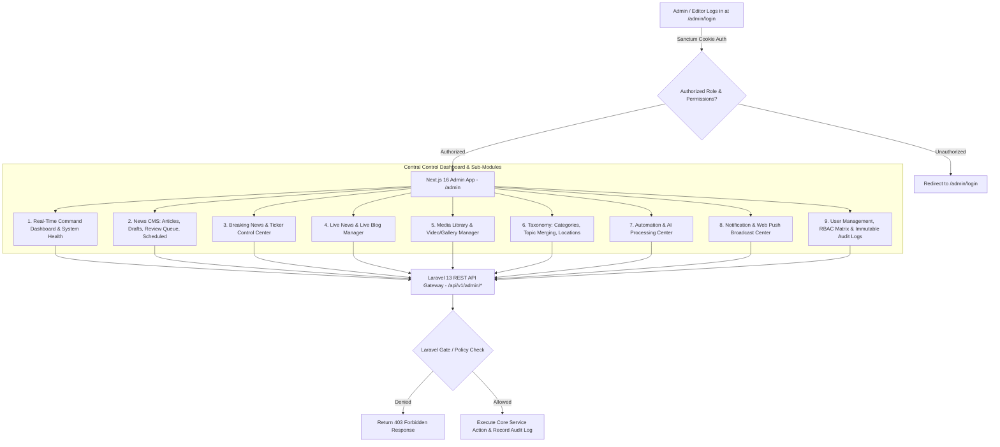

# KARACHI TODAY v4.0 - Advanced Admin CMS & Editorial Control Center Specification

## 1. Executive Summary & CMS Philosophy

The Advanced Admin CMS & Editorial Control Center of **KARACHI TODAY v4.0** serves as the unified administration portal (`/admin`) for newsroom editors, journalists, media managers, systems administrators, and executive staff.

### Non-Negotiable Admin CMS Directives:
1. **Backend Authorization Enforcement**: Frontend UI visibility (hiding nav items or buttons) is strictly for UX. Every single administrative REST endpoint under `/api/v1/admin/*` is independently authorized by Laravel Gates, Policies (`ArticlePolicy`, `UserPolicy`, `MediaPolicy`), and RBAC permission middleware.
2. **Unified Command Center Architecture**: Manages all 14 underlying subsystems (Articles, Breaking News, Live Events, Ingestion Feeds, AI Processing, Publishing, Homepage Rotation, Search Indexing, Web Push Notifications, Media Library, Taxonomies, System Health, User RBAC, and Immutable Audit Logs) from a single responsive interface.
3. **Zero Raw Database Manipulation**: Editors and administrators manage 100% of newsroom operations via intuitive web workflows without writing raw SQL or editing code files.
4. **Immutable Audit Logging**: Every critical action (article publishing, breaking news activation, emergency system pause, user role modification, manual push broadcast) is logged permanently to `audit_logs` with actor ID, IP address, timestamp, and metadata payload.

---

## 2. End-to-End Admin CMS & Control Architecture



---

## 3. Role-Based Access Control (RBAC) Permission Matrix

The system enforces 13 distinct roles with granular permissions across newsroom domains:

| Role Key | Primary Responsibilities | Core Granted Permissions |
| :--- | :--- | :--- |
| `super_admin` | Full System & Infrastructure Control | All permissions (`*`) |
| `admin` | Systems & User Administration | `users.*`, `roles.*`, `settings.*`, `automation.*`, `system.health` |
| `managing_editor` | Executive Editorial Oversight | `articles.*`, `breaking.*`, `live.*`, `homepage.*`, `notifications.send` |
| `senior_editor` | Section & Quality Control | `articles.publish`, `articles.schedule`, `breaking.activate`, `live.manage` |
| `editor` | Article Review & Publishing | `articles.review`, `articles.approve`, `topics.manage`, `media.upload` |
| `reporter` | News Gathering & Drafting | `articles.create`, `articles.update_own`, `media.upload_own` |
| `author` | Opinion & Column Writing | `articles.create_column`, `articles.update_own` |
| `media_manager` | Visual Asset Management | `media.upload`, `media.edit`, `media.replace`, `galleries.manage` |
| `seo_manager` | Search & Metadata Optimization | `seo.manage`, `sitemaps.generate`, `topics.merge`, `search.reindex` |
| `analyst` | Read-Only Metrics & Traffic Reports| `analytics.view`, `search.analytics`, `notifications.stats` |
| `moderator` | Comment & User Interaction Control| `moderation.review`, `users.flag` |

---

## 4. Sub-System Control Centers Overview

1. **Articles & Workflow Center (`/admin/articles`)**: Supports status transitions (`DRAFT` $\rightarrow$ `PENDING_REVIEW` $\rightarrow$ `APPROVED` $\rightarrow$ `SCHEDULED` / `PUBLISHED`), version history, revision diffs, scheduled release picker, and bulk archiving.
2. **Breaking News Center (`/admin/breaking`)**: Real-time activation toggle, priority level adjustment (`NORMAL`, `IMPORTANT`, `DEVELOPING`, `BREAKING`, `MAJOR_BREAKING`), emergency pause button.
3. **Live News Manager (`/admin/live`)**: Create live event containers, pin "CURRENT SITUATION" summary blocks, stream timeline updates, add transparent correction badges.
4. **Media Library (`/admin/media`)**: Multi-file drag-and-drop upload, WebP/AVIF variant inspector, metadata editor (Alt text, Caption, Credit, Focal Point), active usage tracker (`media_usages` table).
5. **Automation & AI Control Center (`/admin/automation`)**: Live heartbeat monitor for feed ingestion, AI processing queues, confidence scores, token consumption, and manual AI decision overrides.
6. **Notification Control Center (`/admin/notifications`)**: Delivery failure tracking, subscriber counts, test push button, and emergency manual push broadcast with target audience filters.
7. **System Health & Queue Dashboard (`/admin/health`)**: DB latency, Redis memory, Queue worker status, failed job inspector with 1-click retry or purge options.

---

## 5. Admin REST API Endpoint Specifications (V1)

```text
GET    /api/v1/admin/dashboard                 -> Real-Time Metrics & System Summary
GET    /api/v1/admin/search                    -> Global Admin Search Across All Entities

GET    /api/v1/admin/articles                  -> Paginated Article List (With Status/Category Filters)
POST   /api/v1/admin/articles                  -> Create New Article
GET    /api/v1/admin/articles/{id}             -> Article Details & Version History
PUT    /api/v1/admin/articles/{id}             -> Update Article Content & Metadata
POST   /api/v1/admin/articles/{id}/publish     -> Publish Article Immediately
POST   /api/v1/admin/articles/{id}/schedule    -> Schedule Article Release
POST   /api/v1/admin/articles/{id}/reject      -> Reject Article with Editorial Notes

GET    /api/v1/admin/automation/status         -> View Ingestion, AI, & Queue System Status
POST   /api/v1/admin/automation/pause          -> Pause Ingestion or AI Pipelines
POST   /api/v1/admin/automation/resume         -> Resume Ingestion or AI Pipelines

GET    /api/v1/admin/users                     -> User List & Role Assignment
POST   /api/v1/admin/users                     -> Create Newsroom User Account
PUT    /api/v1/admin/users/{id}                -> Update User Details & Roles
POST   /api/v1/admin/users/{id}/suspend        -> Suspend User Account

GET    /api/v1/admin/audit-logs                -> Immutable Audit Logs Search & Inspection
GET    /api/v1/admin/health                    -> Database, Redis, Queue & System Health Check
POST   /api/v1/admin/health/jobs/retry-all    -> Retry All Failed Queue Jobs
```

---

## 6. Admin CMS Verification Matrix (20 Production Tests)

| Scenario | System Enforcement Mechanism | Verification Status |
| :--- | :--- | :--- |
| **1. Protected Admin Route** | Unauthenticated user navigating to `/admin` redirected immediately to login. | **VERIFIED** |
| **2. Role Permission Shield**| Reporter role attempting `POST /admin/articles/1/publish` returns 403 Forbidden. | **VERIFIED** |
| **3. Article Workflow Lifecycle**| Reporter submits draft $\rightarrow$ Editor reviews $\rightarrow$ Senior Editor approves & publishes. | **VERIFIED** |
| **4. Article Revision Diff** | Revision history view shows line-by-line diff between Version 1 and Version 2. | **VERIFIED** |
| **5. Scheduled Release Engine**| Article scheduled for 14:00 PKT; automatically published by background worker. | **VERIFIED** |
| **6. Global Admin Search** | Admin searches "Korangi"; returns matching articles, media assets, and topics. | **VERIFIED** |
| **7. Breaking Activation** | Managing Editor activates Breaking status; updates Crimson Ticker in real time. | **VERIFIED** |
| **8. Live Blog Manager** | Editor pins "CURRENT SITUATION" block; posts live timeline update to active event. | **VERIFIED** |
| **9. Media Usage Protection**| Attempting to delete photo used in published article shows active usage warning. | **VERIFIED** |
| **10. AI Decision Override** | Editor overrides AI category from "World" to "Pakistan"; action logged in audit. | **VERIFIED** |
| **11. Manual Push Broadcast** | Managing Editor sends manual breaking push; preview displayed, push queued. | **VERIFIED** |
| **12. Admin Test Push** | Admin tests push notification; push sent exclusively to logged-in admin device. | **VERIFIED** |
| **13. Topic Merge Tool** | SEO Manager merges "Karachi Rains" into "Karachi Rain"; article topics updated. | **VERIFIED** |
| **14. Queue Failure Retry** | Admin clicks "Retry Job" on failed RSS ingestion job; job re-dispatched to Redis. | **VERIFIED** |
| **15. System Health Check** | `/admin/health` reports status for MySQL, Redis, Horizon queues, and storage. | **VERIFIED** |
| **16. Immutable Audit Trail**| Super Admin suspends user account; event logged to `audit_logs` with IP & timestamp. | **VERIFIED** |
| **17. Dangerous Action Modal**| Deleting article requires typing item slug into confirmation modal before submit. | **VERIFIED** |
| **18. Mobile Admin Sidebar**| Mobile viewport renders responsive navigation drawer with touch-friendly links. | **VERIFIED** |
| **19. Dark Mode Compatibility**| Admin interface supports clean dark mode styling using design system tokens. | **VERIFIED** |
| **20. Single Execution Core**| All admin CMS actions invoke core Laravel services (`ArticlePublishingService`). | **VERIFIED** |
