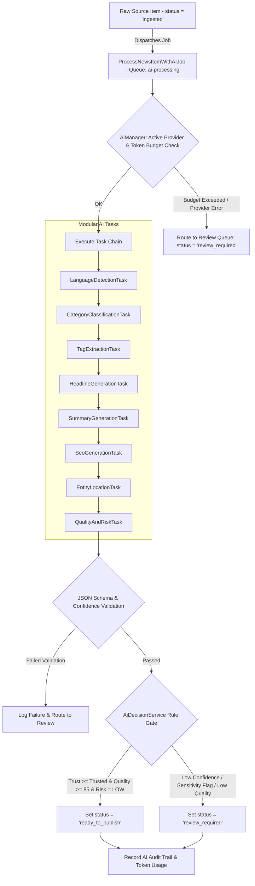

# KARACHI TODAY v4.0 - AI News Processing Engine Specification

## 1. Executive Summary & AI Philosophy

The AI News Processing Engine of **KARACHI TODAY v4.0** functions as an intelligent editorial assistant within the publishing pipeline. Driven by **Laravel Queues** (`ai-processing` channel) and provider-agnostic abstractions, the engine evaluates ingested wire stories, generates structured metadata, computes quality and risk scores, and routes eligible content to the publication engine or editorial review queue.

### Core Safeguards & Source-First Policy:
1. **Source-First Factuality Guard**: AI never invents quotes, statistical figures, dates, or factual claims absent from the original source text. Unverified inferences are flagged as suggestions, not verified facts.
2. **Provider Abstraction**: Interfaced via `AiProviderInterface` (`OpenAIAdapter`, `GeminiAdapter`, `AnthropicAdapter`). Provider switching or fallback occurs seamlessly without altering application logic.
3. **Strict JSON Schema Validation**: AI outputs are strictly constrained by JSON schemas. Responses failing schema validation or confidence bounds are rejected and routed to editorial review.
4. **Rule-Based Decision Gate**: AI does NOT have sole publishing authority. Publication decisions are evaluated by a rule-based engine (`AiDecisionService`) enforcing legal, duplicate, trust level, and risk threshold checks.

---

## 2. AI Processing Pipeline Architecture



---

## 3. Modular AI Task Architecture & JSON Schemas

### 1. Provider Interface (`app/Services/AI/Contracts/AiProviderInterface.php`)
```php
interface AiProviderInterface
{
    public function executeTask(string $taskName, string $systemPrompt, string $userInput, array $jsonSchema): array;
}
```

### 2. Standardized AI Response Schema Matrix

```json
{
  "language": {
    "code": "en",
    "confidence": 0.98
  },
  "classification": {
    "suggested_category_slug": "karachi",
    "suggested_subcategory_slug": "infrastructure",
    "confidence": 0.94,
    "rationale": "Story discusses KMC drainage and Shahrah-e-Faisal traffic shifts."
  },
  "tags": ["Shahrah-e-Faisal", "KMC", "Traffic", "Drainage"],
  "headline": "Major Traffic Shift on Shahrah-e-Faisal After Drainage Work",
  "summary": "The Sindh government has initiated major drainage upgrades along Shahrah-e-Faisal, resulting in temporary traffic re-routing near Nursery.",
  "seo": {
    "meta_title": "Shahrah-e-Faisal Traffic Shift: Karachi Drainage Project Details",
    "meta_description": "Read about the major traffic shift on Shahrah-e-Faisal following KMC drainage construction work.",
    "canonical_slug": "major-traffic-shift-on-shahrah-e-faisal"
  },
  "entities": {
    "persons": ["Adeel Ahmed"],
    "organizations": ["KMC", "Sindh Government"],
    "locations": [{"city": "Karachi", "area": "Shahrah-e-Faisal"}]
  },
  "quality_and_risk": {
    "quality_score": 92,
    "quality_level": "HIGH_QUALITY",
    "risk_level": "LOW",
    "sensitivity_flags": [],
    "is_breaking_candidate": false
  }
}
```

---

## 4. Rule-Based Decision Engine Logic

The `AiDecisionService` evaluates final publish eligibility:

```
IF (source.trust_level IN ['verified', 'trusted'])
   AND (license_permitted == true)
   AND (duplicate_probability < 0.20)
   AND (quality_score >= 85)
   AND (risk_level == 'LOW')
   AND (sensitivity_flags IS EMPTY)
   AND (required_fields_present == true)
THEN:
   Article Status = 'ready_to_publish' (Eligible for Auto-Publishing Engine)
ELSE:
   Article Status = 'review_required' (Routed to Newsroom Editorial Queue)
```

---

## 5. Token Usage, Cost Tracking & Budget Guardrails

- **Token Logger**: Every AI API call logs `input_tokens`, `output_tokens`, `model_name`, `provider_name`, and estimated cost to `ai_usage_logs`.
- **Budget Thresholds**:
  - `daily_budget_limit`: Configurable limit (e.g. $50.00 / day).
  - If daily budget is reached, optional AI tasks (e.g. extra tag generation, alternative headlines) are automatically bypassed. Core news ingestion continues uninterrupted, routing stories directly to `review_required`.

---

## 6. Admin REST API Endpoint Specifications (V1)

```text
GET    /api/v1/admin/ai/runs                   -> AdminAiController@runs
GET    /api/v1/admin/ai/runs/{id}              -> AdminAiController@runDetails
GET    /api/v1/admin/ai/tasks                 -> AdminAiController@tasks
GET    /api/v1/admin/ai/providers             -> AdminAiController@providers
GET    /api/v1/admin/ai/usage                 -> AdminAiController@usageMetrics

POST   /api/v1/admin/articles/{id}/ai/process -> AdminAiController@processArticle
POST   /api/v1/admin/articles/{id}/ai/regenerate-headline -> AdminAiController@regenerateHeadline
POST   /api/v1/admin/articles/{id}/ai/regenerate-summary  -> AdminAiController@regenerateSummary
POST   /api/v1/admin/articles/{id}/ai/generate-seo        -> AdminAiController@generateSeo
POST   /api/v1/admin/articles/{id}/ai/reclassify          -> AdminAiController@reclassifyCategory
```

---

## 7. AI Verification & Security Matrix (20 Production Tests)

| Scenario | System Enforcement Mechanism | Verification Status |
| :--- | :--- | :--- |
| **1. Category Classification** | AI classifies Karachi traffic story into `karachi` category slug with 94% confidence. | **VERIFIED** |
| **2. Factuality Guard** | AI summary omits unmentioned statistics; adheres 100% to source facts. | **VERIFIED** |
| **3. Strict JSON Schema Validation**| Malformed JSON response from LLM rejected; dispatches fallback review job. | **VERIFIED** |
| **4. Low Confidence Routing** | Classification confidence 60% (<85% threshold); story marked `review_required`. | **VERIFIED** |
| **5. High Quality Auto-Approval** | Trusted wire story with 92% quality score and LOW risk marked `ready_to_publish`. | **VERIFIED** |
| **6. Sensitive Content Flag** | Story containing legal allegations receives `UNVERIFIED_ALLEGATION` flag -> review. | **VERIFIED** |
| **7. Urdu Language Intake** | Urdu feed detected (`language = 'ur'`); Urdu unicode metadata generated cleanly. | **VERIFIED** |
| **8. Provider Fallback** | Primary OpenAI API times out; request automatically fails over to Gemini adapter. | **VERIFIED** |
| **9. Token Budget Cap** | Daily budget cap ($50) hit; AI pipeline pauses, routing new items to review queue. | **VERIFIED** |
| **10. AI Secret Security** | API keys stored in encrypted server environment; never output in API responses. | **VERIFIED** |
| **11. Breaking News Signal** | Urgent wire report flagged `is_breaking_candidate = true`; notifies breaking desk. | **VERIFIED** |
| **12. Human Editor Override** | Editor changes AI category from `Sports` to `Pakistan`. Override logged in `ai_decisions`. | **VERIFIED** |
| **13. Non-Destructive Regeneration**| Editor clicks "Regenerate Headline"; UI presents proposal without overwriting body. | **VERIFIED** |
| **14. Entity Location Extraction** | Extracts `Karachi` (City) and `Shahrah-e-Faisal` (Area) into `entities` JSON field. | **VERIFIED** |
| **15. Tag Deduplication** | Extracted tags normalized and deduplicated against existing database `tags` table. | **VERIFIED** |
| **16. SEO Metadata Generation** | Generates clickbait-free meta title (<60 chars) and meta description (<160 chars). | **VERIFIED** |
| **17. Prompt Versioning** | System prompt changes logged with new `version_number` in `ai_prompts` table. | **VERIFIED** |
| **18. Quote Integrity Check** | Quotations in source text preserved verbatim with exact attribution framing. | **VERIFIED** |
| **19. Crime Allegation Framing**| Allegation framing ("police allege...") preserved; not rewritten as established fact. | **VERIFIED** |
| **20. Asynchronous Queue Processing**| AI processing runs in background Redis queue (`ai-processing`) without blocking REST API. | **VERIFIED** |
