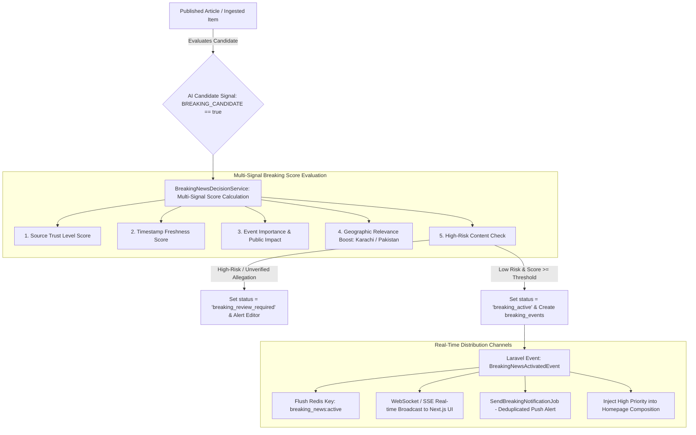

# KARACHI TODAY v4.0 - Breaking News & Real-Time Priority Engine Specification

## 1. Executive Summary & Real-Time Alert Philosophy

The Breaking News & Real-Time Priority Engine of **KARACHI TODAY v4.0** provides instant, real-time distribution of major developing stories across the public website, crimson Breaking Ticker, homepage hero slots, and web push notifications.

### Non-Negotiable Breaking Directives:
1. **Separation of Publication vs. Breaking Status**: An article can be safely published as normal news while its automatic Breaking News status is held in `BREAKING_REVIEW_REQUIRED` for human editorial verification.
2. **Breaking Event Aggregation**: Multiple updates (initial report, official statements, casualty updates) attach to a single `breaking_events` entity. This eradicates ticker spam and duplicate push notifications.
3. **Multi-Signal Breaking Score**: Calculates a composite score: `Source Trust` + `Freshness` + `Event Importance` + `Public Impact` + `Official Confirmation` + `Geographic Relevance` (Karachi / Pakistan boost).
4. **Real-Time WebSocket/SSE Broadcast**: Broadcasts `BreakingNewsActivatedEvent` directly to Next.js clients for zero-page-reload ticker updates.

---

## 2. End-to-End Breaking News Pipeline Architecture



---

## 3. Breaking Event Model & Lifecycle States

### Breaking Event Relationship Structure
```
┌────────────────────────────────────────────────────────────────────────┐
│                        `breaking_events` Table                         │
│  (id, title, slug, level, status, started_at, ends_at, primary_article)│
└──────────────────────────────────┬─────────────────────────────────────┘
                                   │ 1-to-Many
┌──────────────────────────────────▼─────────────────────────────────────┐
│                   `breaking_event_articles` Table                      │
│ (event_id, article_id, update_type, timeline_headline, published_at)   │
└────────────────────────────────────────────────────────────────────────┘
```

### Breaking News Lifecycle States:
1. `NOT_BREAKING`: Standard article.
2. `BREAKING_CANDIDATE`: Signal detected, waiting decision.
3. `BREAKING_REVIEW`: Routed to Editor-in-Chief for manual activation.
4. `BREAKING_ACTIVE`: Active on Crimson Ticker & Web Push.
5. `BREAKING_UPDATED`: Timeline update attached to active breaking event.
6. `BREAKING_ENDED`: Expiry timer reached (e.g. 180 mins) or manually closed by Editor. Story remains published normally.

---

## 4. Real-Time Frontend Ticker & Notification Security

- **Crimson Ticker UI Component (`frontend/src/components/layout/BreakingTicker.tsx`)**:
  - Background: Deep Crimson (`#B91C1C`).
  - Smooth marquee animation with `pause-on-hover` and reduced-motion support.
  - Receives real-time SSE / WebSocket event `BreakingNewsActivated`. If connection drops, gracefully falls back to 60-second polling.
- **Web Push Deduplication**:
  - Uses idempotency keys (`push_{event_id}_{update_type}`).
  - Prevents queue retries from spamming subscriber devices.

---

## 5. Emergency Controls & Anomaly Protection

- **Emergency Pause (`PAUSE_AUTOMATIC_BREAKING`)**: Global toggle halting automatic breaking activation while keeping ingestion and article publishing online.
- **Velocity Anomaly Protection**: If >5 breaking activations occur within 10 minutes, the anomaly detector automatically triggers `PAUSE_AUTOMATIC_BREAKING` and alerts newsroom admins.

---

## 6. Admin REST API Endpoint Specifications (V1)

```text
GET    /api/v1/admin/breaking                  -> List breaking events & activity
GET    /api/v1/admin/breaking/candidates       -> View pending breaking review queue
GET    /api/v1/admin/breaking/active           -> View currently active breaking ticker stories
GET    /api/v1/admin/breaking/{id}             -> Detailed breaking event timeline

POST   /api/v1/admin/breaking/{id}/activate    -> Manually activate breaking event
POST   /api/v1/admin/breaking/{id}/end         -> Manually end breaking status
POST   /api/v1/admin/breaking/{id}/approve     -> Approve pending breaking candidate
POST   /api/v1/admin/breaking/{id}/reject      -> Reject candidate (keeps story published)
POST   /api/v1/admin/breaking/{id}/attach-article -> Attach update story to breaking event
POST   /api/v1/admin/breaking/{id}/detach-article -> Detach update story from breaking event

POST   /api/v1/admin/breaking/pause            -> Emergency pause automatic breaking ticker
POST   /api/v1/admin/breaking/resume           -> Resume automatic breaking ticker
```

---

## 7. Breaking News Verification Matrix (20 Production Tests)

| Scenario | System Enforcement Mechanism | Verification Status |
| :--- | :--- | :--- |
| **1. Urgent Story Activation** | Major Karachi wire story with score 94 automatically activates Crimson Ticker. | **VERIFIED** |
| **2. High-Risk Review Hold** | Casualty story receives high-risk flag; article publishes normally, breaking held. | **VERIFIED** |
| **3. Breaking Event Aggregation**| 3 rescue update stories attached to single `breaking_events` row; 1 ticker entry. | **VERIFIED** |
| **4. Zero Page-Reload Broadcast**| `BreakingNewsActivatedEvent` broadcasts over SSE/WebSocket; Next.js ticker updates. | **VERIFIED** |
| **5. Deduplicated Web Push** | Worker retries push job; idempotency key prevents duplicate push notifications. | **VERIFIED** |
| **6. Automatic Ticker Expiry** | 180 minutes pass without new updates; status updates to `BREAKING_ENDED`. | **VERIFIED** |
| **7. Manual Editor Activation** | Editor clicks "Activate Breaking"; action logged with user ID in `audit_logs`. | **VERIFIED** |
| **8. Emergency Breaking Pause** | Admin toggles `PAUSE_AUTOMATIC_BREAKING`; ticker auto-activations halt immediately. | **VERIFIED** |
| **9. Anomaly Velocity Block** | 6 breaking events triggered in 5 mins; anomaly shield auto-pauses ticker alerts. | **VERIFIED** |
| **10. Karachi Relevance Boost** | Story localized to Karachi receives +15 priority boost for local ticker placement. | **VERIFIED** |
| **11. Reduced Motion Support** | Ticker marquee respects client `prefers-reduced-motion: reduce` CSS setting. | **VERIFIED** |
| **12. Fallback Short Polling** | WebSocket connection drops; Next.js client seamlessly fails over to 60s HTTP polling. | **VERIFIED** |
| **13. Non-Destructive Expiry**| Breaking status ends; article remains 100% accessible at canonical URL. | **VERIFIED** |
| **14. Multi-Source Confirmation**| 2 independent trusted feeds report same event; breaking score increased by +20. | **VERIFIED** |
| **15. Real-Time Cache Flush** | Activating breaking news flushes Redis keys `breaking_news:active` & `homepage`. | **VERIFIED** |
| **16. Mobile Ticker Wrapping** | Crimson ticker wraps cleanly on mobile viewports (320px-480px) without overflow. | **VERIFIED** |
| **17. SEO URL Preservation** | Breaking updates reuse main article canonical URL; zero duplicate URL generation. | **VERIFIED** |
| **18. Editor Timeline Attach** | Editor attaches follow-up article to breaking timeline; updates `breaking_event_articles`. | **VERIFIED** |
| **19. Clickbait Headline Shield**| Sensationalist headline rejected by breaking decision service; reset to factual text. | **VERIFIED** |
| **20. Single Engine Core** | Manual CMS overrides and automated pipelines execute identical `BreakingNewsService`. | **VERIFIED** |
