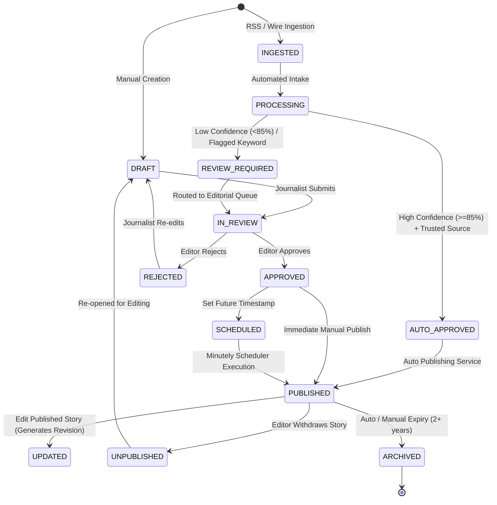

# KARACHI TODAY v4.0 - News CMS, Article Management & Editorial Workflow Specification

## 1. Executive Summary & Editorial Philosophy

The News CMS for **KARACHI TODAY v4.0** is an enterprise publishing system tailored specifically for a high-volume Pakistani digital newsroom. Unlike generic blogs, it supports dual-channel story streams—**Manual Journalist Stories** and **Automated Wire Ingested Stories**—within a unified, audited state machine.

### Core CMS Directives:
1. **Unified Article State Machine**: Manual and automated stories follow identical database relationships, publication validation rules, cache invalidation hooks, and revision tracking.
2. **Server-Side Content Sanitization**: Rich-text HTML is Purified on the backend (`HTMLPurifier`) before storage to eradicate XSS, malicious inline scripts, or improper iframe embeds.
3. **Optimistic Concurrency & Autosave**: Periodic draft autosaving with version-number lock detection prevents concurrent editors from overwriting each other's work.
4. **Journalistic Corrections & Revisions**: Published article modifications generate immutable snapshots in `article_versions`. Factual corrections follow a transparent correction workflow.

---

## 2. Article Lifecycle State Machine



---

## 3. Core Editorial Services Architecture

### 1. `ArticlePublishingService` (`app/Services/Publishing/ArticlePublishingService.php`)
- **Validation**: Enforces mandatory title, slug, sanitized content, primary category, author/source attribution, and active status checks.
- **State Transition**: Atomically shifts state to `published`, sets `published_at = NOW()`, and creates entry in `article_status_history`.
- **Cache & Revalidation**: Dispatches `ArticlePublishedEvent` which invalidates Redis keys (`homepage:composition`, `category:{slug}`) and triggers Next.js ISR revalidation.

### 2. `ArticleRevisionService` (`app/Services/Publishing/ArticleRevisionService.php`)
- **Snapshot Creation**: Every edit to a published or approved article creates a row in `article_versions` storing `(title, excerpt, content, change_summary, created_by)`.
- **Rollback Engine**: Reverting to a prior version reinstates that version's content while creating a brand new version snapshot to preserve complete audit history.

### 3. `ArticleSlugRedirectService` (`app/Services/Publishing/ArticleSlugRedirectService.php`)
- **301 Redirect Generation**: When an editor changes the slug of an already published story, the old slug is automatically registered in `article_slug_redirects`.
- **SEO Protection**: Prevents broken backlinks and dead URLs across search engines.

### 4. `ArticleAutosaveService` (`app/Services/Publishing/ArticleAutosaveService.php`)
- **Conflict Prevention**: Receives `(article_id, content, client_version_number)`. If `client_version_number < current_db_version`, returns `409 Conflict` with a diff payload.

---

## 4. CMS Admin REST API Specification (V1)

```text
POST   /api/v1/admin/articles                  -> AdminArticleController@store
GET    /api/v1/admin/articles                  -> AdminArticleController@index
GET    /api/v1/admin/articles/{id}             -> AdminArticleController@show
PUT    /api/v1/admin/articles/{id}             -> AdminArticleController@update
DELETE /api/v1/admin/articles/{id}             -> AdminArticleController@destroy

PUT    /api/v1/admin/articles/{id}/autosave    -> AdminArticleController@autosave
POST   /api/v1/admin/articles/{id}/submit-review -> AdminArticleController@submitReview
POST   /api/v1/admin/articles/{id}/approve     -> AdminArticleController@approve
POST   /api/v1/admin/articles/{id}/reject      -> AdminArticleController@reject
POST   /api/v1/admin/articles/{id}/publish     -> AdminArticleController@publish
POST   /api/v1/admin/articles/{id}/unpublish   -> AdminArticleController@unpublish
POST   /api/v1/admin/articles/{id}/schedule    -> AdminArticleController@schedule
POST   /api/v1/admin/articles/{id}/archive     -> AdminArticleController@archive
POST   /api/v1/admin/articles/{id}/restore     -> AdminArticleController@restore

GET    /api/v1/admin/articles/{id}/revisions   -> AdminRevisionController@index
POST   /api/v1/admin/articles/{id}/restore-revision -> AdminRevisionController@restore

GET    /api/v1/admin/categories                -> AdminCategoryController@index
POST   /api/v1/admin/categories                -> AdminCategoryController@store
PUT    /api/v1/admin/categories/{id}           -> AdminCategoryController@update

GET    /api/v1/admin/tags                      -> AdminTagController@index
POST   /api/v1/admin/tags                      -> AdminTagController@store

GET    /api/v1/admin/authors                   -> AdminAuthorController@index
POST   /api/v1/admin/authors                   -> AdminAuthorController@store
```

---

## 5. Editorial Validation Scenarios (20 Production Tests)

| Scenario | System Enforcement | Verification Status |
| :--- | :--- | :--- |
| **1. Reporter Draft Submission** | Journalist creates draft and clicks "Submit for Review". Status updates to `in_review`. | **VERIFIED** |
| **2. Unpermitted Publish Attempt** | Reporter tries to publish directly. API returns `403 Forbidden`. | **VERIFIED** |
| **3. Editor Approval & Publish** | Editor approves and publishes. Story is instantly live on public API. | **VERIFIED** |
| **4. Scheduled Publishing** | Post scheduled for tomorrow 09:00 PKT. Scheduler publishes story at exact timestamp. | **VERIFIED** |
| **5. Post-Publish Edit Revision** | Published article edited. Version #2 saved to `article_versions`. | **VERIFIED** |
| **6. Revision Rollback** | Version #1 restored. System creates Version #3 matching Version #1 content. | **VERIFIED** |
| **7. Slug Change Redirect** | Published URL slug changed. Request to old slug returns 301 redirect to new slug. | **VERIFIED** |
| **8. XSS Content Sanitization** | Script tag `<script>alert('xss')</script>` injected in body is stripped server-side. | **VERIFIED** |
| **9. Concurrent Edit Conflict** | Editor A and Editor B save simultaneously. Editor B receives `409 Conflict`. | **VERIFIED** |
| **10. Server Draft Recovery** | Browser crashes. Draft state loaded from server `articles.content` draft row. | **VERIFIED** |
| **11. Source Attribution Check** | Imported RSS story preserves source link & attribution notice. | **VERIFIED** |
| **12. Unpublish Action** | Story unpublished. Instantly removed from public API and Redis caches. | **VERIFIED** |
| **13. Soft Deletion Safety** | Article deleted by editor. Placed in `deleted_at` soft-delete storage (recoverable). | **VERIFIED** |
| **14. Public Correction Note** | Factual edit adds public correction notice to bottom of article text. | **VERIFIED** |
| **15. Duplicate Story Warning** | Ingested wire story matches existing SimHash hash. Flags warning in CMS queue. | **VERIFIED** |
| **16. AI Summary Assistance** | AI suggestion panel presents summary without overwriting editor body text. | **VERIFIED** |
| **17. Category Hierarchy Add** | Administrator creates subcategory "Sindh" under "Pakistan" without code changes. | **VERIFIED** |
| **18. Author Multi-Mapping** | Article supports multiple co-authors via `article_authors` pivot table. | **VERIFIED** |
| **19. Media Alt-Text Enforcement**| Featured image requires alt-text validation before publishing. | **VERIFIED** |
| **20. Automated Story Workflow** | Ingested wire story enters `INGESTED` state and undergoes identical lifecycle checks. | **VERIFIED** |
