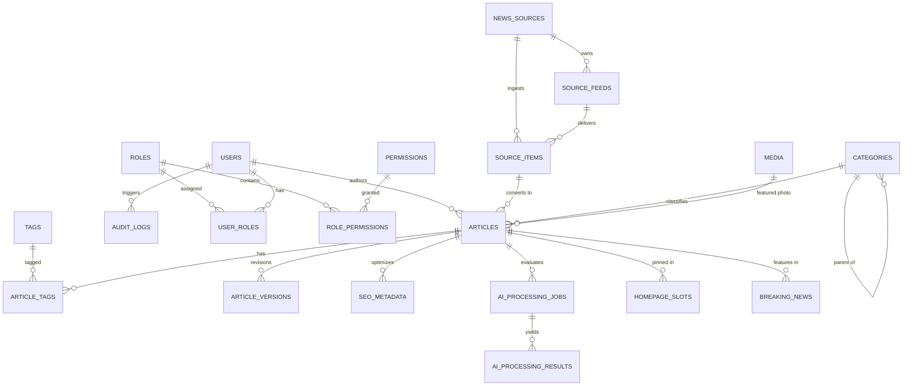

# KARACHI TODAY v4.0 - Enterprise Database Architecture & Data Model (MySQL 8.4 LTS)

## 1. Executive Summary & Core Rules
This document specifies the finalized, production-grade MySQL 8.4 LTS database architecture for **KARACHI TODAY v4.0**. The database is designed for enterprise news publishing, high-volume automated ingestion, AI content processing, dynamic homepage composition, and strict auditability.

### Primary Database Constraints:
- **Storage Engine**: InnoDB
- **Character Set & Collation**: `utf8mb4` / `utf8mb4_unicode_ci`
- **Timezone Strategy**: All timestamp data stored in **UTC**. The application layer converts timestamps to **Asia/Karachi** (PKT) for user presentation.
- **Relational Integrity**: Mandatory Foreign Keys (`ON DELETE RESTRICT` / `ON DELETE CASCADE` where explicitly defined), strict indexing, unique constraints, and transaction safety.
- **Isolation Principle**: Next.js 16 frontend never accesses MySQL directly; all access is mediated by the Laravel 13 REST API.

---

## 2. Domain Entities & Schema Definitions

### DOMAIN 1 — IDENTITY & ACCESS MANAGEMENT (IAM)

#### `roles`
Defines system access levels (Super Admin, Admin, Editor-in-Chief, Managing Editor, Section Editor, News Editor, Reporter, Author, Moderator, SEO Manager, Advertisement Manager, Analyst, Viewer).
- `id`: BIGINT UNSIGNED PK AUTO_INCREMENT
- `name`: VARCHAR(50) NOT NULL UNIQUE
- `slug`: VARCHAR(50) NOT NULL UNIQUE
- `description`: TEXT NULL
- `created_at`, `updated_at`: TIMESTAMP NULL

#### `permissions`
Individual fine-grained capability flags (e.g. `article.publish`, `source.create`, `homepage.override`).
- `id`: BIGINT UNSIGNED PK AUTO_INCREMENT
- `name`: VARCHAR(100) NOT NULL UNIQUE
- `module`: VARCHAR(50) NOT NULL INDEX
- `description`: TEXT NULL
- `created_at`, `updated_at`: TIMESTAMP NULL

#### `role_permissions`
- `role_id`: BIGINT UNSIGNED NOT NULL FK -> `roles(id)` ON DELETE CASCADE
- `permission_id`: BIGINT UNSIGNED NOT NULL FK -> `permissions(id)` ON DELETE CASCADE
- **PRIMARY KEY**: `(role_id, permission_id)`

#### `users`
- `id`: BIGINT UNSIGNED PK AUTO_INCREMENT
- `uuid`: CHAR(36) NOT NULL UNIQUE
- `name`: VARCHAR(191) NOT NULL
- `email`: VARCHAR(191) NOT NULL UNIQUE
- `password`: VARCHAR(255) NOT NULL
- `avatar_id`: BIGINT UNSIGNED NULL
- `bio`: TEXT NULL
- `status`: ENUM('active', 'suspended', 'deactivated') DEFAULT 'active'
- `remember_token`: VARCHAR(100) NULL
- `created_at`, `updated_at`, `deleted_at`: TIMESTAMP NULL (Soft Deletes)

#### `user_roles`
- `user_id`: BIGINT UNSIGNED NOT NULL FK -> `users(id)` ON DELETE CASCADE
- `role_id`: BIGINT UNSIGNED NOT NULL FK -> `roles(id)` ON DELETE CASCADE
- **PRIMARY KEY**: `(user_id, role_id)`

#### `login_attempts`
- `id`: BIGINT UNSIGNED PK AUTO_INCREMENT
- `email`: VARCHAR(191) NOT NULL INDEX
- `ip_address`: VARCHAR(45) NOT NULL
- `user_agent`: VARCHAR(255) NULL
- `successful`: BOOLEAN NOT NULL
- `created_at`: TIMESTAMP DEFAULT CURRENT_TIMESTAMP

---

### DOMAIN 2 — CONTENT MANAGEMENT

#### `categories`
Hierarchical taxonomy supporting main categories (Karachi, Pakistan, World, Business, Sports, Opinion, Culture, Technology, Lifestyle, Health, Video, Live) and subcategories.
- `id`: BIGINT UNSIGNED PK AUTO_INCREMENT
- `parent_id`: BIGINT UNSIGNED NULL FK -> `categories(id)` ON DELETE SET NULL
- `name`: VARCHAR(100) NOT NULL
- `slug`: VARCHAR(100) NOT NULL UNIQUE
- `description`: TEXT NULL
- `color_code`: VARCHAR(10) DEFAULT '#0A192F'
- `display_order`: INT DEFAULT 0 INDEX
- `is_active`: BOOLEAN DEFAULT TRUE INDEX
- `created_at`, `updated_at`, `deleted_at`: TIMESTAMP NULL

#### `tags`
- `id`: BIGINT UNSIGNED PK AUTO_INCREMENT
- `name`: VARCHAR(100) NOT NULL
- `slug`: VARCHAR(100) NOT NULL UNIQUE
- `usage_count`: BIGINT UNSIGNED DEFAULT 0 INDEX
- `created_at`, `updated_at`: TIMESTAMP NULL

#### `authors`
Extended journalistic profile for users.
- `id`: BIGINT UNSIGNED PK AUTO_INCREMENT
- `user_id`: BIGINT UNSIGNED NOT NULL UNIQUE FK -> `users(id)` ON DELETE CASCADE
- `job_title`: VARCHAR(100) DEFAULT 'Staff Reporter'
- `social_links`: JSON NULL
- `article_count`: INT UNSIGNED DEFAULT 0
- `created_at`, `updated_at`: TIMESTAMP NULL

#### `articles`
The core news entity supporting multi-source publishing, scheduling, and AI metadata.
- `id`: BIGINT UNSIGNED PK AUTO_INCREMENT
- `uuid`: CHAR(36) NOT NULL UNIQUE
- `title`: VARCHAR(255) NOT NULL
- `slug`: VARCHAR(255) NOT NULL UNIQUE
- `excerpt`: TEXT NULL
- `content`: LONGTEXT NOT NULL
- `featured_image_id`: BIGINT UNSIGNED NULL FK -> `media(id)` ON DELETE SET NULL
- `primary_category_id`: BIGINT UNSIGNED NOT NULL FK -> `categories(id)` ON DELETE RESTRICT
- `primary_author_id`: BIGINT UNSIGNED NULL FK -> `authors(id)` ON DELETE SET NULL
- `source_id`: BIGINT UNSIGNED NULL FK -> `news_sources(id)` ON DELETE SET NULL
- `source_item_id`: BIGINT UNSIGNED NULL FK -> `source_items(id)` ON DELETE SET NULL
- `status`: ENUM('draft', 'review', 'approved', 'scheduled', 'published', 'updated', 'archived', 'rejected') DEFAULT 'draft' INDEX
- `publish_mode`: ENUM('auto', 'scheduled', 'manual') DEFAULT 'manual' INDEX
- `visibility`: ENUM('public', 'private', 'subscribers_only') DEFAULT 'public'
- `content_type`: ENUM('standard', 'breaking', 'analysis', 'opinion', 'live', 'video') DEFAULT 'standard' INDEX
- `language`: VARCHAR(10) DEFAULT 'en' INDEX
- `reading_time_minutes`: TINYINT UNSIGNED DEFAULT 3
- `views_count`: BIGINT UNSIGNED DEFAULT 0 INDEX
- `content_hash`: VARCHAR(64) NULL INDEX
- `published_at`: DATETIME NULL INDEX
- `scheduled_at`: DATETIME NULL INDEX
- `created_at`, `updated_at`, `deleted_at`: TIMESTAMP NULL (Soft Deletes)
- **COMPOSITE INDEXES**:
  - `idx_pub_status_date`: `(status, published_at DESC)`
  - `idx_cat_pub`: `(primary_category_id, status, published_at DESC)`
  - `idx_hash_dedup`: `(content_hash, created_at)`

#### `article_categories` (Pivot for multi-category assignment)
- `article_id`: BIGINT UNSIGNED NOT NULL FK -> `articles(id)` ON DELETE CASCADE
- `category_id`: BIGINT UNSIGNED NOT NULL FK -> `categories(id)` ON DELETE CASCADE
- **PRIMARY KEY**: `(article_id, category_id)`

#### `article_tags`
- `article_id`: BIGINT UNSIGNED NOT NULL FK -> `articles(id)` ON DELETE CASCADE
- `tag_id`: BIGINT UNSIGNED NOT NULL FK -> `tags(id)` ON DELETE CASCADE
- **PRIMARY KEY**: `(article_id, tag_id)`

#### `article_versions` (Article Versioning & Revision History)
- `id`: BIGINT UNSIGNED PK AUTO_INCREMENT
- `article_id`: BIGINT UNSIGNED NOT NULL FK -> `articles(id)` ON DELETE CASCADE
- `version_number`: INT UNSIGNED NOT NULL
- `title`: VARCHAR(255) NOT NULL
- `excerpt`: TEXT NULL
- `content`: LONGTEXT NOT NULL
- `change_summary`: VARCHAR(255) NULL
- `created_by`: BIGINT UNSIGNED NULL FK -> `users(id)` ON DELETE SET NULL
- `created_at`: TIMESTAMP DEFAULT CURRENT_TIMESTAMP
- **UNIQUE KEY**: `(article_id, version_number)`

#### `article_slug_redirects` (URL Redirect History)
- `id`: BIGINT UNSIGNED PK AUTO_INCREMENT
- `article_id`: BIGINT UNSIGNED NOT NULL FK -> `articles(id)` ON DELETE CASCADE
- `old_slug`: VARCHAR(255) NOT NULL UNIQUE
- `created_at`: TIMESTAMP DEFAULT CURRENT_TIMESTAMP

#### `article_status_history`
- `id`: BIGINT UNSIGNED PK AUTO_INCREMENT
- `article_id`: BIGINT UNSIGNED NOT NULL FK -> `articles(id)` ON DELETE CASCADE
- `from_status`: VARCHAR(50) NULL
- `to_status`: VARCHAR(50) NOT NULL
- `reason`: TEXT NULL
- `user_id`: BIGINT UNSIGNED NULL FK -> `users(id)` ON DELETE SET NULL
- `created_at`: TIMESTAMP DEFAULT CURRENT_TIMESTAMP

---

### DOMAIN 3 — NEWS INGESTION

#### `news_sources`
- `id`: BIGINT UNSIGNED PK AUTO_INCREMENT
- `name`: VARCHAR(191) NOT NULL
- `slug`: VARCHAR(191) NOT NULL UNIQUE
- `type`: ENUM('rss', 'api', 'agency', 'internal', 'manual', 'partner') NOT NULL INDEX
- `base_url`: VARCHAR(500) NOT NULL
- `trust_level`: ENUM('verified', 'trusted', 'review_required', 'blocked') DEFAULT 'review_required' INDEX
- `status`: ENUM('active', 'paused', 'error', 'disabled') DEFAULT 'active' INDEX
- `attribution_requirements`: TEXT NULL
- `polling_interval_minutes`: INT UNSIGNED DEFAULT 15
- `last_successful_sync_at`: DATETIME NULL
- `last_failed_sync_at`: DATETIME NULL
- `configuration`: JSON NULL
- `created_at`, `updated_at`, `deleted_at`: TIMESTAMP NULL

#### `source_feeds`
- `id`: BIGINT UNSIGNED PK AUTO_INCREMENT
- `source_id`: BIGINT UNSIGNED NOT NULL FK -> `news_sources(id)` ON DELETE CASCADE
- `name`: VARCHAR(191) NOT NULL
- `feed_url`: VARCHAR(500) NOT NULL UNIQUE
- `default_category_id`: BIGINT UNSIGNED NULL FK -> `categories(id)` ON DELETE SET NULL
- `is_active`: BOOLEAN DEFAULT TRUE INDEX
- `created_at`, `updated_at`: TIMESTAMP NULL

#### `source_items` (Ingested External Raw Stories)
- `id`: BIGINT UNSIGNED PK AUTO_INCREMENT
- `source_id`: BIGINT UNSIGNED NOT NULL FK -> `news_sources(id)` ON DELETE CASCADE
- `feed_id`: BIGINT UNSIGNED NULL FK -> `source_feeds(id)` ON DELETE CASCADE
- `external_id`: VARCHAR(255) NULL
- `external_url`: VARCHAR(500) NOT NULL
- `title`: VARCHAR(255) NOT NULL
- `description`: TEXT NULL
- `raw_content`: LONGTEXT NULL
- `content_hash`: VARCHAR(64) NOT NULL INDEX
- `published_at`: DATETIME NULL
- `fetched_at`: TIMESTAMP DEFAULT CURRENT_TIMESTAMP INDEX
- `processing_status`: ENUM('pending', 'processed', 'duplicate', 'failed', 'ignored') DEFAULT 'pending' INDEX
- `duplicate_of_item_id`: BIGINT UNSIGNED NULL FK -> `source_items(id)` ON DELETE SET NULL
- `created_at`, `updated_at`: TIMESTAMP NULL
- **UNIQUE KEY**: `(source_id, external_id)`

#### `ingestion_runs`
- `id`: BIGINT UNSIGNED PK AUTO_INCREMENT
- `source_id`: BIGINT UNSIGNED NOT NULL FK -> `news_sources(id)` ON DELETE CASCADE
- `started_at`: DATETIME NOT NULL
- `finished_at`: DATETIME NULL
- `status`: ENUM('running', 'completed', 'failed', 'partial') NOT NULL
- `items_discovered`: INT UNSIGNED DEFAULT 0
- `items_imported`: INT UNSIGNED DEFAULT 0
- `items_skipped`: INT UNSIGNED DEFAULT 0
- `items_failed`: INT UNSIGNED DEFAULT 0
- `error_summary`: TEXT NULL

#### `source_health_logs`
- `id`: BIGINT UNSIGNED PK AUTO_INCREMENT
- `source_id`: BIGINT UNSIGNED NOT NULL FK -> `news_sources(id)` ON DELETE CASCADE
- `response_code`: INT NULL
- `response_time_ms`: INT NULL
- `error_message`: TEXT NULL
- `created_at`: TIMESTAMP DEFAULT CURRENT_TIMESTAMP INDEX

---

### DOMAIN 4 — AI PROCESSING

#### `ai_provider_configs`
- `id`: BIGINT UNSIGNED PK AUTO_INCREMENT
- `provider_name`: VARCHAR(50) NOT NULL UNIQUE (e.g. `openai`, `gemini`, `anthropic`)
- `model_name`: VARCHAR(100) NOT NULL
- `is_active`: BOOLEAN DEFAULT TRUE
- `daily_budget_limit`: DECIMAL(10, 4) DEFAULT 100.00
- `created_at`, `updated_at`: TIMESTAMP NULL

#### `ai_processing_jobs`
- `id`: BIGINT UNSIGNED PK AUTO_INCREMENT
- `source_item_id`: BIGINT UNSIGNED NULL FK -> `source_items(id)` ON DELETE SET NULL
- `article_id`: BIGINT UNSIGNED NULL FK -> `articles(id)` ON DELETE CASCADE
- `job_type`: ENUM('classification', 'summarization', 'headline_generation', 'tagging', 'duplicate_detection', 'priority_scoring', 'breaking_check') NOT NULL INDEX
- `status`: ENUM('queued', 'processing', 'completed', 'failed') DEFAULT 'queued' INDEX
- `attempts`: TINYINT UNSIGNED DEFAULT 0
- `created_at`, `updated_at`: TIMESTAMP NULL

#### `ai_processing_results`
- `id`: BIGINT UNSIGNED PK AUTO_INCREMENT
- `ai_job_id`: BIGINT UNSIGNED NOT NULL FK -> `ai_processing_jobs(id)` ON DELETE CASCADE
- `provider`: VARCHAR(50) NOT NULL
- `model`: VARCHAR(100) NOT NULL
- `input_tokens`: INT UNSIGNED DEFAULT 0
- `output_tokens`: INT UNSIGNED DEFAULT 0
- `confidence_score`: TINYINT UNSIGNED NOT NULL INDEX (0-100)
- `confidence_level`: ENUM('high', 'medium', 'low') NOT NULL INDEX
- `suggested_category_id`: BIGINT UNSIGNED NULL FK -> `categories(id)` ON DELETE SET NULL
- `suggested_tags`: JSON NULL
- `generated_summary`: TEXT NULL
- `suggested_headlines`: JSON NULL
- `is_breaking_candidate`: BOOLEAN DEFAULT FALSE
- `raw_json_response`: JSON NOT NULL
- `created_at`: TIMESTAMP DEFAULT CURRENT_TIMESTAMP

#### `ai_decisions`
- `id`: BIGINT UNSIGNED PK AUTO_INCREMENT
- `article_id`: BIGINT UNSIGNED NOT NULL FK -> `articles(id)` ON DELETE CASCADE
- `decision`: ENUM('auto_publish', 'queue_for_review', 'flag_sensitive', 'reject') NOT NULL INDEX
- `human_overridden`: BOOLEAN DEFAULT FALSE
- `override_user_id`: BIGINT UNSIGNED NULL FK -> `users(id)` ON DELETE SET NULL
- `override_reason`: TEXT NULL
- `created_at`: TIMESTAMP DEFAULT CURRENT_TIMESTAMP

---

### DOMAIN 5 — PUBLISHING & AUTOMATION

#### `automation_rules`
- `id`: BIGINT UNSIGNED PK AUTO_INCREMENT
- `name`: VARCHAR(191) NOT NULL
- `rule_type`: ENUM('ingest_auto_publish', 'breaking_override', 'time_based_shift', 'auto_archive') NOT NULL INDEX
- `priority`: INT DEFAULT 0
- `is_active`: BOOLEAN DEFAULT TRUE INDEX
- `start_time`: TIME NULL
- `end_time`: TIME NULL
- `conditions_json`: JSON NOT NULL
- `actions_json`: JSON NOT NULL
- `created_at`, `updated_at`: TIMESTAMP NULL

#### `scheduled_publications`
- `id`: BIGINT UNSIGNED PK AUTO_INCREMENT
- `article_id`: BIGINT UNSIGNED NOT NULL FK -> `articles(id)` ON DELETE CASCADE
- `target_publish_at`: DATETIME NOT NULL INDEX
- `status`: ENUM('pending', 'executed', 'failed', 'cancelled') DEFAULT 'pending' INDEX
- `created_at`, `updated_at`: TIMESTAMP NULL

---

### DOMAIN 6 — MEDIA

#### `media`
- `id`: BIGINT UNSIGNED PK AUTO_INCREMENT
- `filename`: VARCHAR(255) NOT NULL
- `storage_path`: VARCHAR(500) NOT NULL
- `disk`: VARCHAR(50) DEFAULT 's3'
- `mime_type`: VARCHAR(100) NOT NULL INDEX
- `file_size`: BIGINT UNSIGNED NOT NULL
- `width`: INT UNSIGNED NULL
- `height`: INT UNSIGNED NULL
- `alt_text`: VARCHAR(255) NULL
- `caption`: TEXT NULL
- `credit`: VARCHAR(191) NULL
- `uploaded_by`: BIGINT UNSIGNED NULL FK -> `users(id)` ON DELETE SET NULL
- `created_at`, `updated_at`: TIMESTAMP NULL

#### `media_variants`
- `id`: BIGINT UNSIGNED PK AUTO_INCREMENT
- `media_id`: BIGINT UNSIGNED NOT NULL FK -> `media(id)` ON DELETE CASCADE
- `variant_name`: VARCHAR(50) NOT NULL INDEX (e.g. `hero`, `sub_card`, `thumbnail`, `og_image`)
- `storage_path`: VARCHAR(500) NOT NULL
- `width`: INT UNSIGNED NOT NULL
- `height`: INT UNSIGNED NOT NULL
- `created_at`: TIMESTAMP DEFAULT CURRENT_TIMESTAMP

---

### DOMAIN 7 — BREAKING NEWS

#### `breaking_news`
- `id`: BIGINT UNSIGNED PK AUTO_INCREMENT
- `article_id`: BIGINT UNSIGNED NULL FK -> `articles(id)` ON DELETE SET NULL
- `headline`: VARCHAR(255) NOT NULL
- `ticker_text`: VARCHAR(255) NOT NULL
- `priority`: INT DEFAULT 100 INDEX
- `status`: ENUM('detected', 'verifying', 'active', 'updated', 'resolved', 'expired', 'archived') DEFAULT 'active' INDEX
- `starts_at`: DATETIME NOT NULL INDEX
- `ends_at`: DATETIME NULL INDEX
- `is_manual_override`: BOOLEAN DEFAULT FALSE
- `created_by`: BIGINT UNSIGNED NULL FK -> `users(id)` ON DELETE SET NULL
- `created_at`, `updated_at`: TIMESTAMP NULL

---

### DOMAIN 8 — HOMEPAGE AUTOMATION

#### `homepage_slots`
- `id`: BIGINT UNSIGNED PK AUTO_INCREMENT
- `slot_name`: VARCHAR(50) NOT NULL INDEX (e.g. `hero`, `sub_hero_1`, `sub_hero_2`, `sub_hero_3`, `top_headline_1`..`5`, `banner_ad`)
- `article_id`: BIGINT UNSIGNED NULL FK -> `articles(id)` ON DELETE SET NULL
- `priority`: INT DEFAULT 0
- `is_override`: BOOLEAN DEFAULT FALSE
- `time_shift`: ENUM('morning', 'afternoon', 'evening', 'night', 'all') DEFAULT 'all' INDEX
- `expires_at`: DATETIME NULL INDEX
- `updated_at`: TIMESTAMP DEFAULT CURRENT_TIMESTAMP ON UPDATE CURRENT_TIMESTAMP

#### `homepage_snapshots` (Historical record for analytics / compliance)
- `id`: BIGINT UNSIGNED PK AUTO_INCREMENT
- `snapshot_timestamp`: DATETIME NOT NULL INDEX
- `layout_json`: JSON NOT NULL
- `created_at`: TIMESTAMP DEFAULT CURRENT_TIMESTAMP

---

### DOMAIN 9 — SEO

#### `seo_metadata`
- `id`: BIGINT UNSIGNED PK AUTO_INCREMENT
- `article_id`: BIGINT UNSIGNED NULL UNIQUE FK -> `articles(id)` ON DELETE CASCADE
- `meta_title`: VARCHAR(255) NULL
- `meta_description`: VARCHAR(500) NULL
- `canonical_url`: VARCHAR(500) NULL
- `og_title`: VARCHAR(255) NULL
- `og_description`: VARCHAR(500) NULL
- `og_image_id`: BIGINT UNSIGNED NULL FK -> `media(id)` ON DELETE SET NULL
- `twitter_title`: VARCHAR(255) NULL
- `twitter_description`: VARCHAR(500) NULL
- `schema_json`: JSON NULL
- `created_at`, `updated_at`: TIMESTAMP NULL

---

### DOMAIN 10 — ENGAGEMENT

#### `comments`
- `id`: BIGINT UNSIGNED PK AUTO_INCREMENT
- `article_id`: BIGINT UNSIGNED NOT NULL FK -> `articles(id)` ON DELETE CASCADE
- `user_id`: BIGINT UNSIGNED NULL FK -> `users(id)` ON DELETE SET NULL
- `parent_id`: BIGINT UNSIGNED NULL FK -> `comments(id)` ON DELETE CASCADE
- `author_name`: VARCHAR(100) NOT NULL
- `author_email`: VARCHAR(191) NOT NULL
- `content`: TEXT NOT NULL
- `status`: ENUM('pending', 'approved', 'rejected', 'spam') DEFAULT 'pending' INDEX
- `ip_address`: VARCHAR(45) NULL
- `created_at`, `updated_at`: TIMESTAMP NULL

---

### DOMAIN 11 — ADVERTISEMENT

#### `ad_campaigns`
- `id`: BIGINT UNSIGNED PK AUTO_INCREMENT
- `client_name`: VARCHAR(191) NOT NULL
- `name`: VARCHAR(191) NOT NULL
- `start_date`: DATE NOT NULL
- `end_date`: DATE NOT NULL
- `is_active`: BOOLEAN DEFAULT TRUE INDEX
- `created_at`, `updated_at`: TIMESTAMP NULL

#### `advertisements`
- `id`: BIGINT UNSIGNED PK AUTO_INCREMENT
- `campaign_id`: BIGINT UNSIGNED NOT NULL FK -> `ad_campaigns(id)` ON DELETE CASCADE
- `slot_name`: VARCHAR(50) NOT NULL INDEX (e.g. `header_leaderboard`, `homepage_banner`, `sidebar_rect`)
- `media_id`: BIGINT UNSIGNED NOT NULL FK -> `media(id)` ON DELETE CASCADE
- `target_url`: VARCHAR(500) NOT NULL
- `impressions_count`: BIGINT UNSIGNED DEFAULT 0
- `clicks_count`: BIGINT UNSIGNED DEFAULT 0
- `is_active`: BOOLEAN DEFAULT TRUE INDEX
- `created_at`, `updated_at`: TIMESTAMP NULL

---

### DOMAIN 12 — ANALYTICS

#### `analytics_page_views` (High-Volume Aggregated Storage)
- `id`: BIGINT UNSIGNED PK AUTO_INCREMENT
- `article_id`: BIGINT UNSIGNED NULL FK -> `articles(id)` ON DELETE SET NULL
- `path`: VARCHAR(255) NOT NULL INDEX
- `view_date`: DATE NOT NULL INDEX
- `views_count`: INT UNSIGNED DEFAULT 1
- **UNIQUE KEY**: `(article_id, path, view_date)`

---

### DOMAIN 13 — SYSTEM & AUDIT

#### `system_settings`
- `id`: BIGINT UNSIGNED PK AUTO_INCREMENT
- `key_name`: VARCHAR(100) NOT NULL UNIQUE
- `value`: JSON NOT NULL
- `updated_by`: BIGINT UNSIGNED NULL FK -> `users(id)` ON DELETE SET NULL
- `updated_at`: TIMESTAMP DEFAULT CURRENT_TIMESTAMP ON UPDATE CURRENT_TIMESTAMP

#### `audit_logs`
- `id`: BIGINT UNSIGNED PK AUTO_INCREMENT
- `user_id`: BIGINT UNSIGNED NULL FK -> `users(id)` ON DELETE SET NULL
- `action`: VARCHAR(100) NOT NULL INDEX
- `auditable_type`: VARCHAR(100) NOT NULL
- `auditable_id`: BIGINT UNSIGNED NOT NULL
- `old_values`: JSON NULL
- `new_values`: JSON NULL
- `ip_address`: VARCHAR(45) NULL
- `user_agent`: VARCHAR(255) NULL
- `created_at`: TIMESTAMP DEFAULT CURRENT_TIMESTAMP INDEX

---

## 3. High-Level Consolidated ERD (Mermaid)

---

## 4. Laravel Eloquent Model Map & Migration Order

### Migration Sequence Order (Dependency Safe)
1. `0001_create_roles_permissions_tables.php`
2. `0002_create_users_table.php`
3. `0003_create_categories_tags_tables.php`
4. `0004_create_media_tables.php`
5. `0005_create_news_sources_feeds_tables.php`
6. `0006_create_source_items_table.php`
7. `0007_create_articles_table.php`
8. `0008_create_article_pivot_and_version_tables.php`
9. `0009_create_ai_processing_tables.php`
10. `0010_create_publishing_automation_tables.php`
11. `0011_create_breaking_news_tables.php`
12. `0012_create_homepage_slots_tables.php`
13. `0013_create_seo_engagement_ad_tables.php`
14. `0014_create_analytics_audit_tables.php`

### Eloquent Model Mapping

| Model Name | Table Name | Key Relationships | Soft Deletes |
| :--- | :--- | :--- | :--- |
| `User` | `users` | `belongsToMany(Role)`, `hasMany(Article)` | Yes |
| `Role` | `roles` | `belongsToMany(Permission)`, `belongsToMany(User)` | No |
| `Category` | `categories` | `belongsTo(Category, parent)`, `hasMany(Category, children)` | Yes |
| `Article` | `articles` | `belongsTo(Category)`, `belongsToMany(Tag)`, `hasMany(ArticleVersion)`, `hasOne(SeoMetadata)`, `belongsTo(NewsSource)` | Yes |
| `ArticleVersion` | `article_versions` | `belongsTo(Article)` | No |
| `NewsSource` | `news_sources` | `hasMany(SourceFeed)`, `hasMany(SourceItem)` | Yes |
| `SourceItem` | `source_items` | `belongsTo(NewsSource)`, `belongsTo(SourceFeed)` | No |
| `AiProcessingJob`| `ai_processing_jobs`| `belongsTo(SourceItem)`, `belongsTo(Article)`, `hasOne(AiProcessingResult)` | No |
| `HomepageSlot` | `homepage_slots` | `belongsTo(Article)` | No |
| `BreakingNews` | `breaking_news` | `belongsTo(Article)` | No |

---

## 5. Architectural Validation Matrix (15 Real-World Scenarios)

| Scenario | Architectural Support Mechanism | Verification Status |
| :--- | :--- | :--- |
| **1. RSS Ingestion** | Stored in raw state inside `source_items` with full payload and source reference. | **PASSED** |
| **2. Duplicate Detection** | `source_items.content_hash` SimHash/SHA-256 prevents duplicate inserts via UNIQUE constraint. | **PASSED** |
| **3. AI Processing** | Results stored in `ai_processing_results` preserving original `source_items` intact. | **PASSED** |
| **4. Editorial Queue** | Articles with AI confidence < 85% saved with `status = 'review'`. | **PASSED** |
| **5. Automated Publish** | Trusted sources with AI confidence >= 85% set to `status = 'published'` & `publish_mode = 'auto'`. | **PASSED** |
| **6. Scheduled Posts** | `scheduled_publications` checked every 1 min by Laravel Scheduler (`target_publish_at <= NOW()`). | **PASSED** |
| **7. Breaking Override** | `breaking_news` priority = 100 overrides normal homepage slots in `GET /api/v1/homepage`. | **PASSED** |
| **8. Hero Rotation** | Time-based `homepage_slots` and automation rules update Hero article based on time shift. | **PASSED** |
| **9. Editor Overrides** | `homepage_slots.is_override = true` logged with editor ID in `audit_logs`. | **PASSED** |
| **10. Version Recovery** | Every publish/update creates a new immutable row in `article_versions`. | **PASSED** |
| **11. Source Health** | HTTP response codes and fail times logged in `source_health_logs` and `news_sources`. | **PASSED** |
| **12. Scalable Analytics** | `analytics_page_views` aggregated daily by path/article avoiding massive log table lockups. | **PASSED** |
| **13. URL Redirects** | Old slugs preserved in `article_slug_redirects` for 301 SEO canonical redirection. | **PASSED** |
| **14. Fallback Protection** | Homepage API returns latest published stories if automation rules return zero items. | **PASSED** |
| **15. Dynamic Categories** | Database-driven hierarchy in `categories` allows instant category addition without code changes. | **PASSED** |

---

## 6. Database Security, Archiving & Timezone Strategy

1. **Security & Secrets**: Database password and API secrets stored exclusively in `.env` (never committed to git). Encrypted columns used for external API tokens if required.
2. **Archiving Strategy**: `articles` older than 2 years with low traffic automatically marked as `status = 'archived'`. Archive queries hit dedicated read-replica indexes.
3. **Backup & Disaster Recovery**: Hourly automated MySQL binary log backups + daily full InnoDB snapshots via `mysqldump` / AWS RDS point-in-time recovery.
