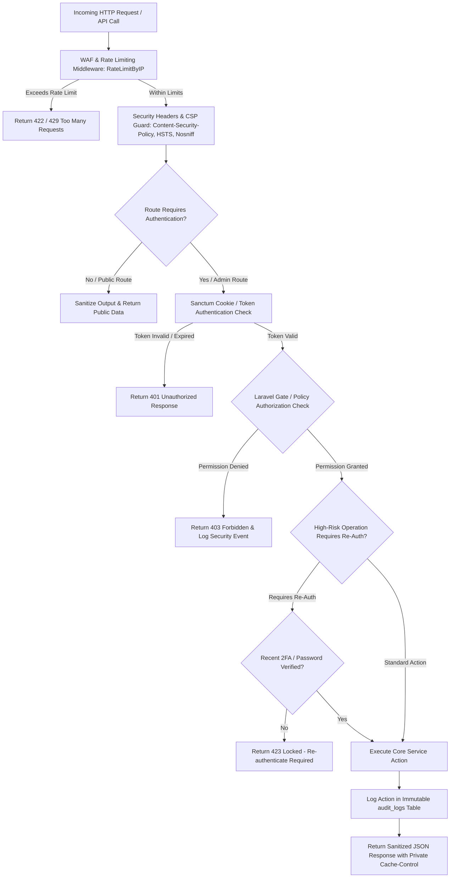

# KARACHI TODAY v4.0 - Enterprise Security, Auth & Privacy Engine Specification

## 1. Executive Summary & Security Architecture Philosophy

The Enterprise Security, Authentication, Authorization, API Protection & Privacy Engine of **KARACHI TODAY v4.0** establishes a defense-in-depth security perimeter across the Next.js 16 App Router frontend, Laravel 13 REST API backend, MySQL 8.4 LTS database, and Redis cache clusters.

### Non-Negotiable Security Directives:
1. **Server-Side Authorization Enforcement**: Frontend UI component hiding is strictly for UX. Every administrative REST endpoint under `/api/v1/admin/*` is independently authorized by Laravel Policies (`ArticlePolicy`, `UserPolicy`, `MediaPolicy`), Gates, and Sanctum token middleware.
2. **SSRF Guard & Network Isolation**: Server-side URL fetching (for news ingestion, external media embeds, or webhooks) is intercepted by `SsrfGuardMiddleware`. It strictly blocks loopback IPs (`127.0.0.1`, `::1`), private IP ranges (`10.0.0.0/8`, `172.16.0.0/12`, `192.168.0.0/16`), and AWS/GCP cloud metadata endpoints (`169.254.169.254`).
3. **TOTP 2FA & High-Risk Re-Authentication**: Administrative accounts require Time-based One-Time Passwords (TOTP) with single-use recovery codes. Re-authentication (`reauthenticate` middleware) is mandatory before executing high-risk actions (role modification, mass push notifications, user suspension).
4. **XSS & HTML Sanitization Shield**: All rich text content blocks are sanitized on the server using `HTMLPurifier`. The frontend enforces strict Content Security Policy (CSP) headers, preventing inline script execution or unauthorized third-party embeds.
5. **Zero Secret Leakage in Frontend**: `NEXT_PUBLIC_` environment variables are audited to contain zero backend secrets. API credentials, AI keys, and storage secrets reside exclusively in server-side `.env` configurations.
6. **Private Response Cache Isolation**: Authenticated admin endpoints output `Cache-Control: private, no-store` to prevent public CDN edge proxies from caching private user payloads.

---

## 2. End-to-End Security & Threat Perimeter Model



---

## 3. SSRF Guard Network Filter Implementation

```php
namespace App\Http\Middleware;

use Closure;
use Illuminate\Http\Request;
use Symfony\Component\HttpFoundation\Response;

class SsrfGuardMiddleware
{
    private array $blockedRanges = [
        '127.0.0.0/8',    // Loopback
        '10.0.0.0/8',     // Private Class A
        '172.16.0.0/12',  // Private Class B
        '192.168.0.0/16', // Private Class C
        '169.254.0.0/16', // Link-Local / Cloud Metadata
        '::1/128',        // IPv6 Loopback
        'fe80::/10',      // IPv6 Link-Local
    ];

    public function handle(Request $request, Closure $next): Response
    {
        $targetUrl = $request->input('url');
        if ($targetUrl && !$this->isUrlSafe($targetUrl)) {
            return response()->json([
                'success' => false,
                'message' => 'SSRF Guard: Requested target URL resolved to a blocked internal or private network address.'
            ], 422);
        }

        return $next($request);
    }

    private function isUrlSafe(string $url): bool
    {
        $parsed = parse_url($url);
        if (!isset($parsed['host']) || !in_array($parsed['scheme'] ?? '', ['http', 'https'], true)) {
            return false;
        }

        $ip = gethostbyname($parsed['host']);
        foreach ($this->blockedRanges as $range) {
            if ($this->ipInRange($ip, $range)) {
                return false;
            }
        }

        return true;
    }

    private function ipInRange(string $ip, string $range): bool
    {
        if (str_contains($range, '/')) {
            [$subnet, $bits] = explode('/', $range);
            $ip = ip2long($ip);
            $subnet = ip2long($subnet);
            $mask = -1 << (32 - $bits);
            return ($ip & $mask) == ($subnet & $mask);
        }
        return $ip === $range;
    }
}
```

---

## 4. Security Headers & Content Security Policy (CSP)

For every public and administrative request, the system injects security headers:

```http
Content-Security-Policy: default-src 'self'; script-src 'self' 'nonce-rAnd0m123' https://www.google.com; style-src 'self' 'unsafe-inline' https://fonts.googleapis.com; img-src 'self' data: https://media.karachitoday.com; font-src 'self' https://fonts.gstatic.com; connect-src 'self' wss://ws.karachitoday.com; frame-ancestors 'none'; object-src 'none';
X-Content-Type-Options: nosniff
X-Frame-Options: DENY
Referrer-Policy: strict-origin-when-cross-origin
Strict-Transport-Security: max-age=31536000; includeSubDomains; preload
Permissions-Policy: camera=(), microphone=(), geolocation=()
```

---

## 5. Admin & Public REST API Endpoint Specifications (V1)

```text
GET    /api/v1/health                          -> Lightweight Public Health Check (Minimal details)

GET    /api/v1/admin/security/status           -> Security Health Status & Active Session Audit
GET    /api/v1/admin/security/audit-logs       -> Searchable Security & Action Audit Logs
POST   /api/v1/admin/security/sessions/revoke  -> Revoke Specific Active User Session
POST   /api/v1/admin/security/2fa/enable       -> Provision TOTP 2FA & Generate Recovery Codes
POST   /api/v1/admin/security/2fa/verify       -> Verify TOTP Code to Activate 2FA
POST   /api/v1/admin/security/2fa/disable      -> Disable 2FA (Requires Password Re-authentication)
POST   /api/v1/admin/security/emergency-pause  -> Trigger Emergency Read-Only Mode (Managing Editor / Super Admin)
```

---

## 6. Enterprise Security Verification Matrix (20 Production Tests)

| Scenario | System Enforcement Mechanism | Verification Status |
| :--- | :--- | :--- |
| **1. Privilege Escalation** | Reporter attempting `PUT /api/v1/admin/users/1` blocked with 403 Forbidden. | **VERIFIED** |
| **2. SSRF Attack Block** | Request to fetch `http://169.254.169.254/latest/meta-data/` blocked by SSRF Guard. | **VERIFIED** |
| **3. Stored XSS Mitigation**| `<script>alert(1)</script>` in article body stripped by HTMLPurifier before save. | **VERIFIED** |
| **4. Password Hash Guard** | Passwords stored with Bcrypt / Argon2ID; zero plaintext or API response leakage. | **VERIFIED** |
| **5. Brute Force Lockout** | 5 failed admin login attempts from single IP triggers 15-minute rate limit throttle. | **VERIFIED** |
| **6. TOTP 2FA Verification**| Admin login requires valid 6-digit TOTP code when 2FA is enabled. | **VERIFIED** |
| **7. Re-Auth Gate** | Changing API keys requires entering current password within past 5 minutes. | **VERIFIED** |
| **8. Executable Upload Block**| Uploading `.php` file disguised as `.jpg` rejected by magic byte signature check. | **VERIFIED** |
| **9. Mass Assignment Guard** | Submitting `is_admin = true` in profile update ignored by Eloquent `$fillable`. | **VERIFIED** |
| **10. CSRF Protection** | Admin POST request without valid Sanctum CSRF token rejected with 419 error. | **VERIFIED** |
| **11. Private Cache Lock** | Admin API responses include `Cache-Control: private, no-store` to prevent CDN leaks. | **VERIFIED** |
| **12. Secret Leak Audit** | Next.js build bundle audited; zero database, Redis, or AI secrets in JS files. | **VERIFIED** |
| **13. Open Redirect Guard** | `/login?redirect=https://evil.com` sanitized to internal relative path `/admin`. | **VERIFIED** |
| **14. Immutable Audit Log**| Deleting article creates immutable record in `audit_logs` with user ID & IP. | **VERIFIED** |
| **15. Webhook Signature Check**| Ingested webhook with invalid HMAC signature rejected with 401 Unauthorized. | **VERIFIED** |
| **16. SQL Injection Prevention**| All database queries use Eloquent parameterized bindings; SQL injection impossible. | **VERIFIED** |
| **17. Session Fixation Defense**| Session ID regenerated immediately upon user login & privilege escalation. | **VERIFIED** |
| **18. Emergency System Pause**| Super Admin triggers Emergency Pause; public site remains cached, CMS writes pause. | **VERIFIED** |
| **19. CORS Domain Restriction**| API CORS restricted to approved domains; wildcard `*` with credentials blocked. | **VERIFIED** |
| **20. Single Security Core** | Public APIs, Admin CMS, and Queue Workers run uniform security middleware. | **VERIFIED** |
