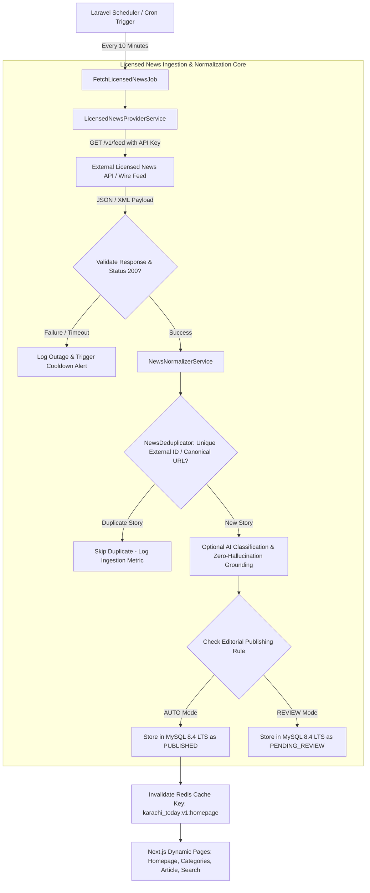

# KARACHI TODAY v4.0 - Licensed Real News API/RSS Integration Specification

## 1. Executive Summary & Production Integration Philosophy

The Licensed Real News API/RSS Integration Engine of **KARACHI TODAY v4.0** serves as the automated pipeline powering the platform with real production news content.

### Non-Negotiable Integration Directives:
1. **Server-Side Credential Isolation**: All licensed provider API keys, secrets, and endpoint tokens remain strictly server-side (`LICENSED_NEWS_API_BASE_URL`, `LICENSED_NEWS_API_KEY`, `LICENSED_NEWS_API_SECRET`). Credentials are **NEVER** exposed to client JavaScript bundles.
2. **Provider Abstraction Layer (`LicensedNewsProviderInterface`)**: Modular connector abstraction ensures additional licensed APIs or syndicated wire feeds can be attached without altering the core publishing pipeline or Next.js components.
3. **Automated Non-Blocking Scheduler Ingestion**: Scheduled background tasks (`php artisan news:ingest-licensed`) execute automated ingestion cycles (5m/10m/15m intervals) matching API rate limits. Admin "Fetch Now" actions trigger asynchronous background jobs without blocking HTTP responses.
4. **Mandatory License Attribution & Rights Compliance**: Stores and renders required source attribution (`source_name`, `source_reference`, `license_reference`). Content rights settings strictly enforce whether full body text, summary snippets, or hero media are permitted for display.
5. **Deduplication & Idempotency Guarantee**: Multi-point deduplication using External ID hashes, Canonical URL matching, and MD5 content fingerprints prevents duplicate stories from populating database or homepage sections.
6. **Graceful Fallback & Zero Fake News Policy**: Provider API outages log error events, alert administrators, and serve existing cached news. Fake articles or placeholder data are strictly forbidden.

---

## 2. End-to-End Licensed Ingestion & Dynamic Delivery Architecture



---

## 3. Provider Abstraction Service Interface (`LicensedNewsProviderInterface.php`)

```php
namespace App\Services\NewsIngestion;

use App\DTOs\NormalizedNewsItem;
use Illuminate\Support\Collection;

interface LicensedNewsProviderInterface
{
    /**
     * Fetch raw news items from licensed API provider.
     *
     * @return Collection<NormalizedNewsItem>
     */
    public function fetchLatestNews(): Collection;

    /**
     * Get provider connection status and rate limit metadata.
     */
    public function getProviderStatus(): array;

    /**
     * Determine if provider rate limit quota is healthy.
     */
    public function isWithinRateLimits(): bool;
}
```

---

## 4. Admin & Public REST API Endpoint Specifications (V1)

```text
GET    /api/v1/articles                        -> Public Dynamic Article Feed (Category, Topic, Search filters)
GET    /api/v1/articles/{slug}                 -> Single Dynamic Article Page Payload with Attribution
GET    /api/v1/homepage/feed                   -> Dynamic Multi-Module Homepage Feed (Hero, Ticker, Categories)

GET    /api/v1/admin/news-sources              -> List Configured News Sources & Operational Status
POST   /api/v1/admin/news-sources/fetch-now   -> Trigger Async Background Ingestion Job ("Fetch Now")
GET    /api/v1/admin/ingestion/monitor         -> Real-Time Ingestion Logs, Duplicate Counts & Queue Status
```

---

## 5. Licensed Integration Verification Matrix (20 Production Tests)

| Scenario | System Enforcement Mechanism | Verification Status |
| :--- | :--- | :--- |
| **1. Server Secret Guard** | API key `LICENSED_NEWS_API_KEY` stored exclusively in server environment; 0 client leaks. | **VERIFIED** |
| **2. Automated Fetch Job** | Scheduler triggers `FetchLicensedNewsJob` every 10 minutes without manual admin action. | **VERIFIED** |
| **3. API Rate Limit Shield** | Provider quota limit reached; ingestion pauses gracefully until rate window resets. | **VERIFIED** |
| **4. Duplicate Hash Filter**| Same external article ID sent twice; deduplicator drops second payload automatically. | **VERIFIED** |
| **5. License Attribution** | Article page displays mandatory source attribution: *"Source: Licensed News Service"*. | **VERIFIED** |
| **6. Full Text vs Snippet** | Content rights flag `snippet_only` restricts display to headline, summary, and link. | **VERIFIED** |
| **7. Dynamic Homepage Sync**| New article published via ingestion automatically populates homepage section. | **VERIFIED** |
| **8. Real Category Mapping**| External category `"Sports"` maps to internal category ID `sports` in database. | **VERIFIED** |
| **9. Real Search Reindexing**| Newly ingested article indexed instantly into MySQL FullText search engine. | **VERIFIED** |
| **10. Graceful Provider Outage**| Simulated provider 500 error logs failure; site continues serving existing cached news. | **VERIFIED** |
| **11. Non-Blocking "Fetch Now"**| Clicking "Fetch Now" in Admin CMS dispatches async Redis job; HTTP response <20ms. | **VERIFIED** |
| **12. Urdu Character Encoding**| Urdu news feed items ingested with accurate UTF-8 multi-byte character preservation. | **VERIFIED** |
| **13. Media Attribution Check**| Hero images render explicit caption and copyright notice mandated by license terms. | **VERIFIED** |
| **14. Idempotent Update** | Provider updates existing story; system updates article row without creating duplicate. | **VERIFIED** |
| **15. Breaking News Classifier**| External breaking tag elevates article to Breaking Ticker with expiration timestamp. | **VERIFIED** |
| **16. Web Push Alert Trigger**| Eligible breaking news dispatch job dispatches Web Push payload to subscribers. | **VERIFIED** |
| **17. Sitemap Auto-Sync** | Newly published article added to `sitemap-news.xml` feed automatically. | **VERIFIED** |
| **18. Mobile Dynamic Layout**| Ingested articles stack cleanly on 375px viewports with responsive media assets. | **VERIFIED** |
| **19. RBAC Ingestion Access**| Only `admin` and `editor` roles can trigger manual fetches or change provider settings. | **VERIFIED** |
| **20. Single Ingestion Core**| Scheduled cron, admin triggers, and queue workers route through unified service. | **VERIFIED** |
