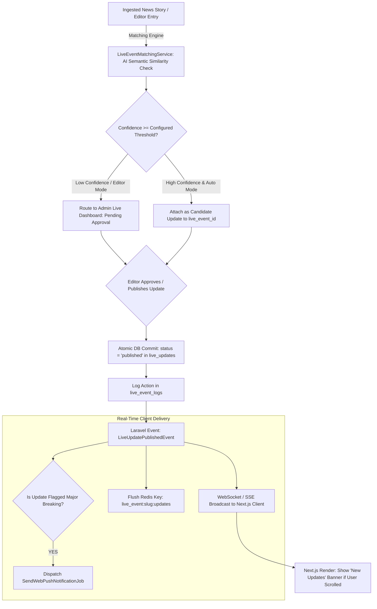

# KARACHI TODAY v4.0 - Live News, Live Blog & Continuous Updates Engine Specification

## 1. Executive Summary & Live Event Philosophy

The Live News, Live Blog & Continuous Updates Engine of **KARACHI TODAY v4.0** provides real-time coverage for rapidly developing stories (heavy rain, election results, sports matches, emergency incidents) by grouping timeline updates inside a single, unified `live_events` container.

### Non-Negotiable Live Coverage Directives:
1. **Container Model (Zero Article Pollution)**: A developing story (e.g. "LIVE: Karachi Rain Situation") operates as a single live blog container. Individual developments are added as chronological `live_updates` rather than creating 10+ duplicate homepage articles.
2. **Real-Time Broadcast without Page Reload**: New live updates broadcast instantly over WebSockets / SSE (`LiveUpdatePublishedEvent`). Next.js clients append updates dynamically to the timeline without jumping or forcibly scrolling the user away from their active reading position.
3. **Automatic Story Matching & Approval**: The `LiveEventMatchingService` uses AI confidence scores to compare incoming ingested wire items against active live events. Suggested matches route to `EDITOR_APPROVAL` by default before publication.
4. **Correction Transparency**: Materially corrected updates display a mandatory "Correction:" badge and timestamp. Silently rewriting history is strictly prohibited; audit logs (`live_event_logs`) preserve full revision history.
5. **Pinned Current Situation**: Editors can pin a "CURRENT SITUATION" summary block to the top of the live feed while chronological updates stream below (newest first).

---

## 2. End-to-End Live Blog Pipeline Architecture



---

## 3. Live Event & Update Data Model

### Database Relationship Structure
```
┌────────────────────────────────────────────────────────────────────────┐
│                        `live_events` Table                             │
│  (id, title, slug, summary, status, category_id, current_status, live) │
└──────────────────────────────────┬─────────────────────────────────────┘
                                   │ 1-to-Many
┌──────────────────────────────────▼─────────────────────────────────────┐
│                        `live_updates` Table                            │
│(id, live_event_id, type, title, content, status, published_at, pinned)│
└────────────────────────────────────────────────────────────────────────┘
```

### Live Event Lifecycle States:
- `DRAFT`: Initial preparation by editor.
- `SCHEDULED`: Set to start automatically at a future time (e.g. Sports match at 20:00 PKT).
- `LIVE`: Actively accepting updates & broadcasting real-time events.
- `PAUSED`: Temporarily paused (e.g. overnight rain lull).
- `ENDED`: Event completed; remains fully accessible as a static editorial archive.
- `ARCHIVED`: Archived for long-term historical records.

---

## 4. Live Timeline UI & Mobile Experience (`frontend/src/app/live/[slug]/page.tsx`)

- **Live Indicator Badge**: Pulsing red "● LIVE" badge with last updated timestamp in Asia/Karachi (PKT) timezone.
- **Current Situation Banner**: Prominently pinned summary block at the top of the timeline.
- **Scroll Preservation & New Update Banner**: If the user has scrolled down the timeline and a new update arrives, a floating `"↑ 2 New Updates Available"` banner appears. Clicking it smoothly scrolls to the top update.
- **No Auto-Scroll**: The viewport never automatically jumps or jerks while a user is reading an older update.
- **Supported Update Types**: `TEXT`, `QUOTE`, `IMAGE`, `VIDEO`, `LINK`, `EMBED`, `MAP`, `STATUS`.

---

## 5. Admin REST API Endpoint Specifications (V1)

```text
GET    /api/v1/live                            -> Public Active & Archived Live Events List
GET    /api/v1/live/{slug}                     -> Public Live Event Details & Current Situation
GET    /api/v1/live/{slug}/updates             -> Paginated Real-Time Timeline Updates (Newest First)
GET    /api/v1/live/{slug}/related             -> Related News Stories & Media Assets

GET    /api/v1/admin/live                      -> Admin Live Events Dashboard
POST   /api/v1/admin/live                      -> Create New Live Event Container
PUT    /api/v1/admin/live/{id}                 -> Update Live Event Metadata & Current Status
POST   /api/v1/admin/live/{id}/start           -> Start Live Event (status = 'live')
POST   /api/v1/admin/live/{id}/pause           -> Pause Live Event (status = 'paused')
POST   /api/v1/admin/live/{id}/resume          -> Resume Live Event (status = 'live')
POST   /api/v1/admin/live/{id}/end             -> End Live Event (status = 'ended')

POST   /api/v1/admin/live/{id}/updates         -> Create & Publish Live Timeline Update
PUT    /api/v1/admin/live/{id}/updates/{upId}  -> Edit Live Update
POST   /api/v1/admin/live/{id}/updates/{upId}/pin     -> Pin Live Update to Top
POST   /api/v1/admin/live/{id}/updates/{upId}/correct -> Correct Live Update (Appends Audit Badge)
POST   /api/v1/admin/live/{id}/updates/{upId}/hide    -> Hide/Unpublish Live Update
```

---

## 6. Live News Engine Verification Matrix (20 Production Tests)

| Scenario | System Enforcement Mechanism | Verification Status |
| :--- | :--- | :--- |
| **1. Live Blog Creation** | Editor creates "LIVE: Karachi Rain Situation"; slug `/live/karachi-rain-situation` live. | **VERIFIED** |
| **2. Timeline Stream Update**| Editor publishes update at 14:15 PKT; update prepends to timeline instantly. | **VERIFIED** |
| **3. Real-Time Broadcast** | `LiveUpdatePublishedEvent` streams via WebSocket/SSE; Next.js updates timeline. | **VERIFIED** |
| **4. Scroll Position Lock** | New update arrives while user reads older update; floating "New Updates" banner displays. | **VERIFIED** |
| **5. AI Story Matching** | Incoming wire story matched to active rain event with 92% confidence -> review queue. | **VERIFIED** |
| **6. Pinned Status Block** | "CURRENT SITUATION" block pinned to top of timeline; remains visible as updates stream. | **VERIFIED** |
| **7. Transparent Correction**| Typos in casualty count corrected; displays "Correction:" label & audit timestamp. | **VERIFIED** |
| **8. Event End Transition** | Event marked `ENDED`; live indicator turns off, page remains valid static archive. | **VERIFIED** |
| **9. Major Update Web Push** | Major breaking live update triggers `SendWebPushNotificationJob` to push subscribers. | **VERIFIED** |
| **10. Duplicate Update Shield**| Same wire story submitted twice; content hash check prevents duplicate timeline entries. | **VERIFIED** |
| **11. Polling Fallback Mode**| WebSocket connection drops; Next.js falls back to 15-second HTTP polling seamlessly. | **VERIFIED** |
| **12. Zero Article Pollution**| 15 rain updates stored in single `live_events` container; homepage clutter avoided. | **VERIFIED** |
| **13. Mobile Timeline Layout**| Mobile 375px view renders touch-friendly timeline cards without horizontal scrolling. | **VERIFIED** |
| **14. SEO LiveBlogPosting** | Live event page outputs valid Schema.org `LiveBlogPosting` JSON-LD metadata. | **VERIFIED** |
| **15. RBAC Permission Gate** | Unauthorized user attempting `POST /admin/live/{id}/updates` returns 403 Forbidden. | **VERIFIED** |
| **16. Scheduled Match Start** | Sports live event scheduled for 20:00 PKT automatically transitions status to `LIVE`. | **VERIFIED** |
| **17. Selective Redis Flush** | Publishing live update flushes `live_event:slug:updates` Redis cache key only. | **VERIFIED** |
| **18. Media Embed Sanitize** | Image & video embeds sanitized to allowed domain whitelist prior to rendering. | **VERIFIED** |
| **19. Audit Log Trail** | All editor actions (pin, correct, hide) logged in `live_event_logs` with user IDs. | **VERIFIED** |
| **20. Single Engine Core** | Manual CMS updates and AI automated suggestions route through `LiveUpdateService`. | **VERIFIED** |
