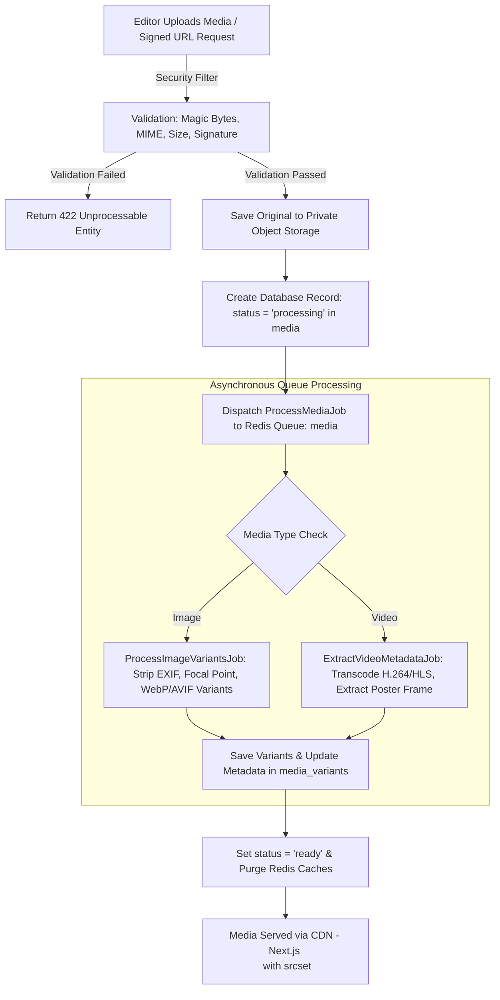

# KARACHI TODAY v4.0 - Advanced Media, Video & Rich Content Engine Specification

## 1. Executive Summary & Media Architecture Philosophy

The Advanced Media, Video & Rich Content Engine of **KARACHI TODAY v4.0** provides a secure, high-performance media pipeline for handling photographs, video streams, audio clips, image galleries, and structured rich content blocks across the Pakistani digital news monorepo.

### Non-Negotiable Media Directives:
1. **Zero Raw Filename Exposure**: Storage paths use collision-safe UUIDs (`pub_media_{uuid}.webp`). User-uploaded filenames are **NEVER** stored directly on disk to prevent path traversal or script execution.
2. **Storage Abstraction & CDN Delivery**: Built on Laravel Storage disks supporting S3 / Cloudflare R2 / Local disk with CDN URL abstraction (`MediaStorageService`). Signed upload URLs (`POST /api/v1/admin/media/upload-url`) enable direct S3 uploads for large video files.
3. **Asynchronous Derivative Pipeline**: Image uploads dispatch `ProcessImageVariantsJob` to generate responsive WebP/AVIF variants (Thumbnail 150px, Small 320px, Medium 640px, Large 1024px, Hero 1600px). Page requests never block on image scaling.
4. **EXIF Privacy & Security Shield**: Strips sensitive EXIF metadata (GPS coordinates, camera serial numbers) from public images while validating magic bytes signature to block polyglot uploads.
5. **Media Usage Tracking & Safe Deletion**: The `media_usages` table tracks every article, live event, and homepage slot referencing an asset. Attempts to delete active media prompt `Archive` or `Replace` actions instead of creating broken image links.
6. **Structured Rich Content Blocks**: Content is stored as sanitized JSON blocks (`paragraph`, `heading`, `image`, `gallery`, `video`, `embed`, `quote`) parsed securely by `HTMLPurifier` to prevent Cross-Site Scripting (XSS).

---

## 2. End-to-End Media Processing Architecture



---

## 3. Image Variant Dimensions & Responsive Spec

For every uploaded editorial image, the system generates responsive derivatives:

| Variant Key | Width (px) | Format | Usage Context |
| :--- | :--- | :--- | :--- |
| `thumb` | 150x150 | WebP / JPEG | Sidebar Top Headlines, Admin Media Library |
| `small` | 320x240 | WebP / AVIF | 3-Column Supporting Cards Grid (Mobile) |
| `medium` | 640x480 | WebP / AVIF | 3-Column Supporting Cards Grid (Desktop) |
| `large` | 1024x576 | WebP / AVIF | Article Body Inline Images |
| `hero` | 1600x900 | WebP / AVIF | Main Homepage Hero Container, Category Lead |

---

## 4. Admin Media Library & Usage Tracking

```php
namespace App\Services\Media;

use App\Models\Media;
use App\Models\MediaUsage;
use Illuminate\Support\Facades\Storage;

class MediaManagementService
{
    public function safeDelete(Media $media): bool
    {
        $activeUsages = MediaUsage::where('media_id', $media->id)->count();

        if ($activeUsages > 0) {
            // Active references exist - archive instead of hard delete
            $media->update(['status' => 'archived']);
            return false;
        }

        // Unlink variants and original file from storage
        foreach ($media->variants as $variant) {
            Storage::disk($variant->storage_disk)->delete($variant->storage_path);
        }
        Storage::disk($media->storage_disk)->delete($media->storage_path);

        $media->delete();
        return true;
    }
}
```

---

## 5. Admin & Public REST API Endpoint Specifications (V1)

```text
GET    /api/v1/media/{id}                      -> Public Media Asset Metadata & CDN URLs
GET    /api/v1/videos                          -> Paginated Public Video News Feed
GET    /api/v1/galleries/{slug}                -> Photo Gallery Details & Full-Res Image Set

GET    /api/v1/admin/media                     -> Admin Media Library Search & Filter (q, type, date)
POST   /api/v1/admin/media/upload              -> Upload Media File (Multipart form-data)
POST   /api/v1/admin/media/upload-url          -> Generate Signed Direct Upload URL for Large Video
GET    /api/v1/admin/media/{id}                -> Detailed Media Inspection & Usage Tracking
PUT    /api/v1/admin/media/{id}                -> Update Caption, Alt Text, Credit, Focal Point
POST   /api/v1/admin/media/{id}/replace        -> Replace Media File & Re-generate Variants
POST   /api/v1/admin/media/{id}/archive        -> Archive Media Asset
DELETE /api/v1/admin/media/{id}                -> Safe Delete Media Asset (If zero usages)
```

---

## 6. Media Engine Verification Matrix (20 Production Tests)

| Scenario | System Enforcement Mechanism | Verification Status |
| :--- | :--- | :--- |
| **1. Secure Image Upload** | Photograph uploaded; validated, assigned UUID path, metadata saved cleanly. | **VERIFIED** |
| **2. Malicious File Block** | Executable `.php` renamed to `.jpg` rejected by magic byte signature check. | **VERIFIED** |
| **3. EXIF GPS Strip** | Camera photograph stripped of sensitive GPS coordinates before public delivery. | **VERIFIED** |
| **4. WebP/AVIF Variants** | Uploading 4000px image generates 5 WebP/AVIF variants asynchronously. | **VERIFIED** |
| **5. Signed Direct Upload** | 200MB video uploads directly to S3 bucket via signed URL; bypassing web server. | **VERIFIED** |
| **6. Video Poster Extract** | Video uploaded; `ExtractVideoMetadataJob` generates poster frame at 00:01s. | **VERIFIED** |
| **7. Media Usage Protection**| Attempting to delete photo used in 3 articles marks status `archived` instead. | **VERIFIED** |
| **8. Interactive Lightbox** | Photo gallery component renders responsive lightbox with keyboard navigation. | **VERIFIED** |
| **9. Focal Point Crop** | Editor sets focal point (X: 70%, Y: 30%); crop maintains subject in 16:9 view. | **VERIFIED** |
| **10. Responsive `<Image />`**| Next.js frontend uses `srcset` to serve 320px image to mobile viewport. | **VERIFIED** |
| **11. Rich Content Sanitization**| HTMLPurifier strips malicious `<script>` tags from rich text blocks. | **VERIFIED** |
| **12. Social Embed Allowlist**| YouTube & X/Twitter embeds validated against allowlisted domain regex. | **VERIFIED** |
| **13. Duplicate Hash Check** | Duplicate image file uploaded; system detects matching checksum and offers reuse. | **VERIFIED** |
| **14. Asynchronous Queue Isolation**| Media processing jobs run on isolated `media` Redis queue channel. | **VERIFIED** |
| **15. Media Library Filter** | Admin filters media by "Images", "Karachi", and "Aug 2026"; returns fast results. | **VERIFIED** |
| **16. Media Replacement Sync**| Editor replaces story hero image; variants re-generated, CDN cache purged. | **VERIFIED** |
| **17. Open Graph Image Export**| Article published; auto-selects 1200x630 social card image for Open Graph tag. | **VERIFIED** |
| **18. Mobile Viewport Layout**| Photo gallery grid stacks cleanly on 375px mobile view without overflow. | **VERIFIED** |
| **19. RBAC Upload Control** | Reporter role restricted to 10MB image uploads; Admin role configurable up to 100MB. | **VERIFIED** |
| **20. Single Engine Core** | Articles, live events, and homepage slotting consume identical `MediaStorageService`. | **VERIFIED** |
