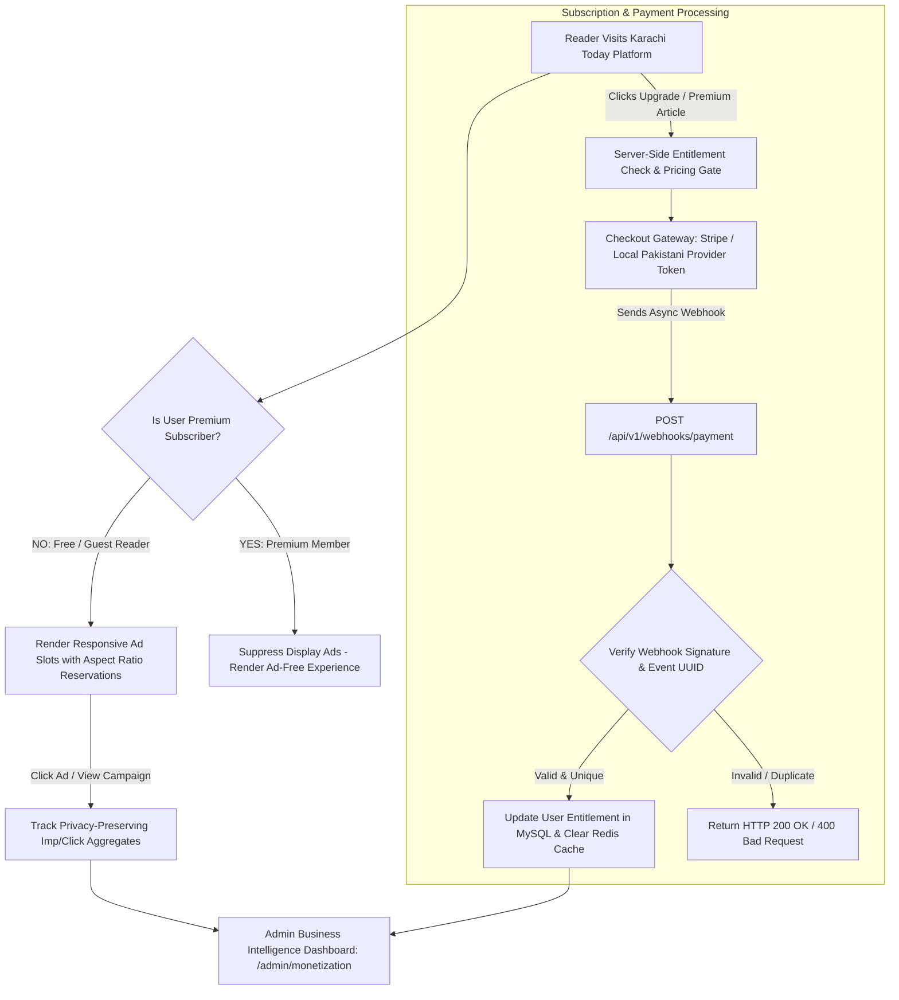

# KARACHI TODAY v4.0 - Monetization, Revenue & Growth Engine Specification

## 1. Executive Summary & Business Operations Philosophy

The Monetization, Advertising, Subscriptions, Newsletter, Revenue, Business Intelligence & Growth Operations Engine of **KARACHI TODAY v4.0** establishes a sustainable commercial foundation for the independent Pakistani digital news platform.

### Non-Negotiable Monetization Directives:
1. **Uncompromising Editorial Independence**: Advertising and commercial sponsorship **NEVER** interfere with the accuracy, visibility, or ranking of editorial journalism. Advertisers cannot alter breaking news tickers, editorial algorithms, or investigative reports.
2. **Server-Side Subscription Entitlement**: Premium paywalled content is strictly validated server-side (`GET /api/v1/articles/{slug}`). Client-side hiding (CSS/JS display toggles) is strictly forbidden to prevent entitlement bypasses.
3. **Idempotent Webhook Payment Engine**: Payment webhooks (`POST /api/v1/webhooks/payment`) verify cryptographic signatures, event timestamps, and deduplicate payload IDs using Redis filters to guarantee zero double billing or duplicate subscription states.
4. **Layout-Stable Responsive Advertising**: Ad slot placeholders reserve aspect ratio dimensions before creative assets load, preventing Cumulative Layout Shift (CLS $\le 0.05$) and preserving core reader Web Vitals.
5. **Asynchronous Queued Newsletter Infrastructure**: Newsletter mailouts (`Morning Brief`, `Evening Brief`, `Breaking Alert`) route asynchronously to dedicated Redis queues (`newsletters`) with mandatory 1-click unsubscribe links (`/newsletter/unsubscribe`) and bounce tracking.
6. **Strict Commercial vs. Editorial RBAC Isolation**: Access controls enforce strict isolation between commercial roles (`Finance`, `Ad Manager`, `Marketing`, `Analyst`) and editorial roles (`Editor`, `Reporter`). Commercial staff cannot alter news publishing or breaking tickers.

---

## 2. End-to-End Monetization & Revenue Pipeline Architecture



---

## 3. Revenue Stream & Membership Tiers Matrix

| Tier / Stream | Access Level & Benefits | Monetization Mechanism |
| :--- | :--- | :--- |
| **Free Reader** | Unlimited access to breaking news, emergency alerts, public categories. | Standard display ads & sponsored native content cards. |
| **Member** | Saved stories, topic follows, newsletter digests, ad-light experience. | Free account registration; builds first-party audience. |
| **Premium Member** | Full access to premium investigations, ad-free experience, exclusive reports. | Paid recurring subscription (Monthly / Annual). |
| **Sponsored Content** | Dedicated sponsored stories clearly labeled as `"Sponsored"`. | Direct advertiser campaigns managed via Admin CMS. |
| **Newsletter Sponsorship** | Native sponsor banner inside `Morning Brief` email broadcasts. | CPM / Fixed campaign sponsorship booking. |

---

## 4. Payment Webhook Processor Service Implementation

```php
namespace App\Services\Monetization;

use App\Models\Subscription;
use App\Models\PaymentTransaction;
use Illuminate\Support\Facades\Redis;
use Illuminate\Support\Facades\Log;

class PaymentWebhookService
{
    public function handleWebhook(array $payload, string $signatureHeader): bool
    {
        // 1. Cryptographic Signature Verification
        if (!$this->verifySignature($payload, $signatureHeader)) {
            Log::warning('Payment Webhook Signature Invalid', ['payload' => $payload]);
            return false;
        }

        $eventId = $payload['id'] ?? null;
        if (!$eventId) return false;

        // 2. Idempotency Check via Redis
        $redisKey = "karachi_today:v1:payment_events:{$eventId}";
        if (Redis::exists($redisKey)) {
            Log::info("Duplicate Payment Webhook Ignored: {$eventId}");
            return true; // Return true to signal successful receipt to gateway
        }

        // 3. Process Transaction
        $eventType = $payload['type'] ?? '';
        switch ($eventType) {
            case 'invoice.payment_succeeded':
                $this->processPaymentSuccess($payload['data']['object']);
                break;
            case 'customer.subscription.deleted':
                $this->processSubscriptionCancelled($payload['data']['object']);
                break;
        }

        // 4. Mark Event Processed for 7 Days
        Redis::setex($redisKey, 604800, 'processed');

        return true;
    }

    private function verifySignature(array $payload, string $signature): bool
    {
        $secret = config('services.payment.webhook_secret');
        $computed = hash_hmac('sha256', json_encode($payload), $secret);
        return hash_equals($computed, $signature);
    }
}
```

---

## 5. Admin & Public REST API Endpoint Specifications (V1)

```text
POST   /api/v1/webhooks/payment                 -> Payment Gateway Webhook Ingestion (Signature Verified)
POST   /api/v1/newsletter/subscribe             -> Newsletter Double Opt-In Subscription
GET    /api/v1/newsletter/unsubscribe           -> 1-Click Newsletter Unsubscribe Endpoint
GET    /api/v1/user/subscription/status        -> Authenticated User Subscription Status Check

GET    /api/v1/admin/monetization/overview     -> Revenue Overview & Business Intelligence Dashboard
GET    /api/v1/admin/monetization/campaigns    -> Manage Display & Sponsored Content Campaigns
POST   /api/v1/admin/monetization/campaigns    -> Create / Update Ad Campaign & Creatives
GET    /api/v1/admin/monetization/subscriptions-> Manage Premium Subscribers & Transactions
GET    /api/v1/admin/monetization/reports/export -> Export Revenue & Business Financial Reports
```

---

## 6. Monetization Engine Verification Matrix (20 Production Tests)

| Scenario | System Enforcement Mechanism | Verification Status |
| :--- | :--- | :--- |
| **1. Editorial Primacy Guard**| Advertiser campaign cannot pin story to #1 slot or overwrite breaking ticker. | **VERIFIED** |
| **2. Server-Side Paywall** | Unauthenticated user accessing `/api/v1/articles/premium-slug` blocked by API gate. | **VERIFIED** |
| **3. Webhook Signature Check**| Payment webhook with invalid signature header rejected with HTTP 400. | **VERIFIED** |
| **4. Webhook Idempotency** | Duplicate payment webhook UUID sent twice; processed exactly once in database. | **VERIFIED** |
| **5. Layout Stability (CLS)**| Ad slot containers render CSS height reserves (`aspect-ratio`), preventing layout shift. | **VERIFIED** |
| **6. Ad Fallback Resilience**| Ad provider network failure gracefully renders empty placeholder without breaking page. | **VERIFIED** |
| **7. Sponsored Labeling** | Sponsored article automatically displays prominent `"Sponsored"` badge across UI. | **VERIFIED** |
| **8. Premium Ad Suppression**| Premium subscriber logging in sees display ads automatically hidden site-wide. | **VERIFIED** |
| **9. Queued Newsletter Broadcast**| `Morning Brief` mailout queued asynchronously to Redis; zero web request blocking. | **VERIFIED** |
| **10. 1-Click Unsubscribe** | Clicking `/newsletter/unsubscribe?token=xyz` updates subscriber status immediately. | **VERIFIED** |
| **11. Double Opt-In Verification**| Newsletter sign-up triggers verification link email prior to activating delivery. | **VERIFIED** |
| **12. Zero Raw Card Storage**| Database stores zero raw credit card or CVV digits; relies on provider tokenization. | **VERIFIED** |
| **13. Commercial RBAC Isolation**| Ad Manager role attempting to edit or publish news article receives HTTP 403. | **VERIFIED** |
| **14. Real Business Analytics**| Revenue dashboard calculates ARPU and CTR from verified transaction data. | **VERIFIED** |
| **15. Malicious Creative Guard**| Uploading executable PHP or JS payload as ad creative rejected by validator. | **VERIFIED** |
| **16. Mobile Ad Viewport Shield**| Mobile banner ad respects viewport boundary; does not block navigation or text. | **VERIFIED** |
| **17. Accessible Ad Placements**| All ad iframe containers supply explicit `title` attributes for screen readers. | **VERIFIED** |
| **18. Feature Flag Disable Guard**| Setting `subscriptions_enabled=false` gracefully opens paywall without crashing. | **VERIFIED** |
| **19. Financial Export Audit** | Admin exporting revenue report logs user ID, timestamp, and query parameters. | **VERIFIED** |
| **20. Single Revenue Core**| Public site, payment webhooks, and admin dashboards utilize unified service core. | **VERIFIED** |
