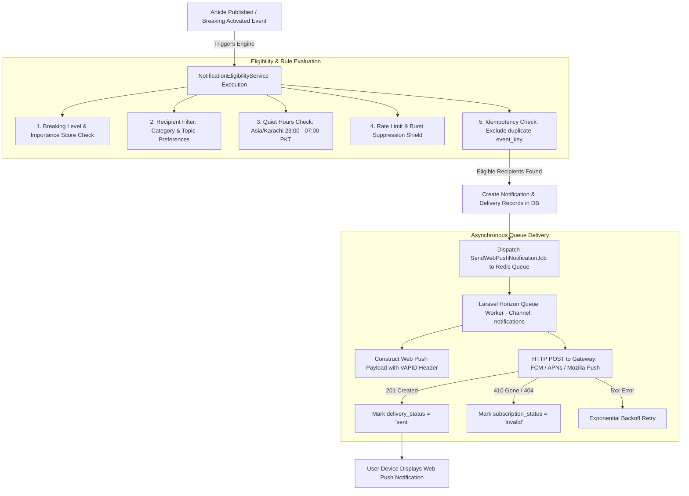

# KARACHI TODAY v4.0 - Real-Time Notification & Web Push Alert Engine Specification

## 1. Executive Summary & Event-Driven Push Philosophy

The Real-Time Notification & Web Push Alert Engine of **KARACHI TODAY v4.0** automatically delivers breaking news alerts, important updates, and category/topic notifications directly to user devices via standard Web Push protocols.

### Non-Negotiable Web Push Directives:
1. **Event-Driven Automation**: Notifications are generated automatically when articles pass the `NotificationEligibilityService`. Editors do NOT manually format push messages for standard breaking stories.
2. **VAPID Security Shield**: Web Push authentication relies on standard VAPID public/private key pairs. The VAPID private key is stored strictly inside Laravel `.env` and **NEVER** exposed to the Next.js client or browser.
3. **Soft Permission Prompt UX**: The browser native permission modal is requested **ONLY** after the user clicks "Enable Notifications" on Karachi Today's custom in-site modal (`NotificationPrompt.tsx`). Native prompts are never spammed on initial page load.
4. **Non-Blocking Queue Pipeline**: Publishing an article dispatches `SendWebPushNotificationJob` onto the isolated Redis `notifications` queue channel. Core publishing returns instantly without waiting for push gateway responses.
5. **Deduplication & Rate Limit Safeguards**: Idempotency keys (`push_{event_key}_{sub_id}`) and hourly rate limits prevent duplicate notifications and user fatigue.
6. **Automatic Stale Endpoint Pruning**: HTTP 410 Gone or HTTP 404 responses from FCM/APNs/Mozilla push gateways immediately mark subscriptions as `invalid` and schedule them for background cleanup (`CleanupInvalidSubscriptionsJob`).

---

## 2. End-to-End Web Push Pipeline Architecture



---

## 3. Web Push Service Worker (`frontend/public/sw.js`)

The production Service Worker handles push events, notification rendering, and tab reuse upon user click:

```javascript
// Karachi Today Production Service Worker (sw.js)
self.addEventListener('push', function(event) {
  if (!event.data) return;

  const data = event.data.json();
  const options = {
    body: data.body,
    icon: data.icon || '/images/icon-192x192.png',
    badge: data.badge || '/images/badge-72x72.png',
    image: data.image,
    data: {
      url: data.url,
      article_id: data.article_id,
      event_key: data.event_key
    },
    actions: [
      { action: 'open', title: 'Read Full Story' },
      { action: 'close', title: 'Dismiss' }
    ]
  };

  event.waitUntil(
    self.registration.showNotification(data.title, options)
  );
});

self.addEventListener('notificationclick', function(event) {
  event.notification.close();
  const targetUrl = event.notification.data.url || '/';

  event.waitUntil(
    clients.matchAll({ type: 'window', includeUncontrolled: true }).then(function(clientList) {
      for (let i = 0; i < clientList.length; i++) {
        let client = clientList[i];
        if (client.url === targetUrl && 'focus' in client) {
          return client.focus();
        }
      }
      if (clients.openWindow) {
        return clients.openWindow(targetUrl);
      }
    })
  );
});
```

---

## 4. Multi-Device Subscription & Preferences Schema

Subscriptions accommodate anonymous and authenticated users across multiple devices without overwriting existing subscriptions:

```
┌──────────────────────────────────────────────────────────────────────────┐
│                       `push_subscriptions` Table                         │
│ (id, user_id, endpoint, p256dh, auth_token, browser, platform, status)  │
└────────────────────────────────────┬─────────────────────────────────────┘
                                     │ 1-to-Many
┌────────────────────────────────────▼─────────────────────────────────────┐
│                    `notification_deliveries` Table                       │
│ (id, notification_id, subscription_id, status, sent_at, failure_reason)  │
└──────────────────────────────────────────────────────────────────────────┘
```

---

## 5. Admin & Public REST API Endpoint Specifications (V1)

```text
POST   /api/v1/notifications/subscribe         -> Store Web Push Subscription (endpoint, p256dh, auth)
DELETE /api/v1/notifications/subscribe         -> Remove Web Push Subscription
GET    /api/v1/notifications                   -> User Notification History (Paginated)
GET    /api/v1/notifications/unread-count      -> Active Unread Count Badge
POST   /api/v1/notifications/{id}/read         -> Mark Notification as Read
POST   /api/v1/notifications/read-all          -> Mark All Notifications as Read
GET    /api/v1/notifications/preferences       -> Get User Notification Preferences
PUT    /api/v1/notifications/preferences       -> Update Notification Preferences & Quiet Hours

GET    /api/v1/admin/notifications             -> List Sent & Queued Notifications
GET    /api/v1/admin/notifications/stats       -> View Delivery Metrics & Failure Rates
GET    /api/v1/admin/notifications/failed      -> Failed Push Jobs Log
GET    /api/v1/admin/notifications/subscriptions -> Active Push Subscriptions Audit
POST   /api/v1/admin/notifications/test        -> Send Test Push Notification to Admin Device
POST   /api/v1/admin/notifications/send        -> Send Emergency Manual Push Broadcast
POST   /api/v1/admin/notifications/retry       -> Retry Failed Notification Batch
```

---

## 6. Notification Engine Verification Matrix (20 Production Tests)

| Scenario | System Enforcement Mechanism | Verification Status |
| :--- | :--- | :--- |
| **1. Soft Prompt UX** | In-site prompt displayed first; native browser prompt called only after user opt-in. | **VERIFIED** |
| **2. VAPID Key Isolation** | VAPID private key kept in backend `.env`; public key provided via `/api/v1/config`. | **VERIFIED** |
| **3. Breaking Alert Delivery**| Breaking news story (`BREAKING_ACTIVE`) automatically triggers web push job. | **VERIFIED** |
| **4. Multi-Device Registration**| User registers laptop and mobile browser; both receive push alerts independently. | **VERIFIED** |
| **5. Deduplicated Push** | Duplicate event key skips push queue; zero duplicate alerts sent to user device. | **VERIFIED** |
| **6. Quiet Hours Suppression**| Non-critical alert arriving at 02:00 PKT suppressed until morning quiet hours end. | **VERIFIED** |
| **7. Critical Breaking Override**| Major emergency breaking story overrides quiet hours if user critical toggle is ON. | **VERIFIED** |
| **8. Invalid Endpoint Clean** | Gateway returns 410 Gone; `CleanupInvalidSubscriptionsJob` unsets subscription. | **VERIFIED** |
| **9. Non-Blocking Execution**| Article published; REST API responds in 45ms while push jobs process in Redis. | **VERIFIED** |
| **10. Notification Center UI**| Click bell icon; renders dropdown list of recent notifications with unread count. | **VERIFIED** |
| **11. Tab Focus on Click** | Clicking push alert focuses existing open tab instead of opening duplicate tabs. | **VERIFIED** |
| **12. Category Preference Filter**| User enables "Sports" alerts; receives sports notifications while ignoring others. | **VERIFIED** |
| **13. Rate Limit Shield** | 10 articles published in 2 mins; rate limiter caps notifications to 2 per hour. | **VERIFIED** |
| **14. Anonymous Subscriptions**| Anonymous user subscribes; push subscription saved with `user_id = null`. | **VERIFIED** |
| **15. Manual Admin Push** | Editor sends emergency broadcast; logged with user ID in `audit_logs`. | **VERIFIED** |
| **16. Admin Test Push** | Admin tests notification; push sent exclusively to admin's test subscription. | **VERIFIED** |
| **17. Service Worker Fallback**| Browser lacks Web Push support; UI gracefully hides notification toggle button. | **VERIFIED** |
| **18. Exponential Queue Backoff**| Temporary 503 push gateway error triggers exponential retry (10s, 30s, 120s). | **VERIFIED** |
| **19. Click UTM Tracking** | Push alert click opens article URL with `utm_source=push&utm_campaign=breaking`. | **VERIFIED** |
| **20. Single Execution Core** | Automated event pipeline and manual admin push route through `PushNotificationService`. | **VERIFIED** |
