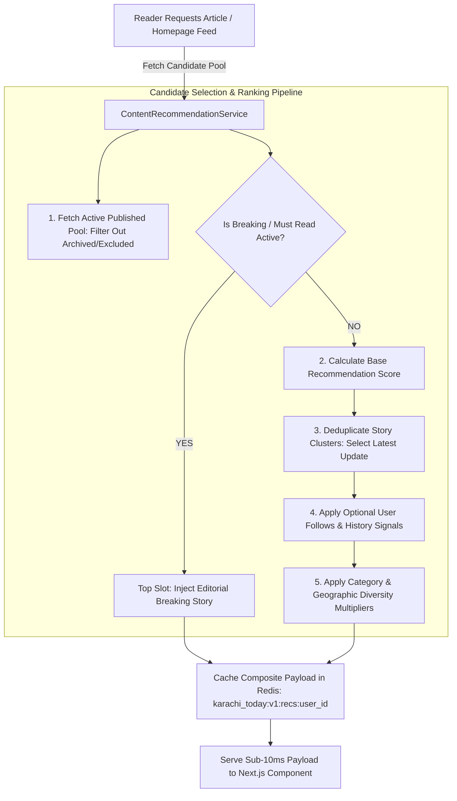

# KARACHI TODAY v4.0 - Advanced Personalization & Smart Recommendation Engine Specification

## 1. Executive Summary & Personalization Philosophy

The Advanced Personalization, Content Discovery, Smart Recommendations & Reader Experience Engine of **KARACHI TODAY v4.0** establishes a privacy-first news discovery architecture for readers across Pakistan and the international Pakistani diaspora.

### Non-Negotiable Reader Experience Directives:
1. **Editorial Overrides Always Command Primacy**: Recommendations **NEVER** replace editorial judgment for critical public interest news. Major breaking news and editorially promoted stories ("Featured", "Must Read") override algorithmic personalization scores.
2. **Multi-Factor Transparent Recommendation Scoring**: Calculates personalized article scores using a balanced formula:
   $$\text{RecScore} = \left( \text{TopicSimilarity} \times 0.35 + \text{FreshnessScore} \times 0.25 + \text{EngagementScore} \times 0.20 + \text{EditorialPriority} \times 0.20 \right) \times \text{DiversityMultiplier}$$
3. **AI Story Clustering & Evolution Graph**: Groups multiple articles covering the same developing event (Initial report $\rightarrow$ Government statement $\rightarrow$ Police update $\rightarrow$ Verdict) into a single evolving story cluster, prioritizing the latest verified update over duplicate articles.
4. **Trend Intelligence & Anti-Fraud Shield**: Measures trend velocity over 15m, 1h, 6h, and 24h windows using bot-filtering rate controls. Clickbait or artificially manipulated low-quality stories are blocked from entering "Trending" lists.
5. **Privacy-First & Account-Optional Design**: Anonymous readers receive high-quality session-based recommendations without forced account creation. Authenticated users get optional features (Follow Topics, Follow Categories, Follow Locations, Saved Reading List, Reading History) with 1-click opt-out and clear history tools.
6. **Content & Geographic Diversity Guardrails**: Recommendation modules enforce a diversity cap (max 2 articles per primary category or topic cluster per feed block) across coarse geographic regions (Karachi, Lahore, Islamabad, Quetta, Peshawar, Rawalpindi).

---

## 2. End-to-End Recommendation & Discovery Architecture



---

## 3. Reader Experience Features Matrix

| Feature Module | Supported Capabilities | User Control & Privacy Safeguards |
| :--- | :--- | :--- |
| **Story Clusters** | Groups evolving news updates under single logical container with timeline. | Prevents 5+ repetitive articles from polluting reader feed. |
| **Follow Topics** | Reader follows topics (e.g. `KElectric`, `Karachi Port`, `Cricket`). | Reader can edit or unfollow topics anytime at `/user/preferences`. |
| **Follow Locations** | Reader selects regions (e.g. `Karachi`, `Sindh`, `Islamabad`). | Coarse regional level only; zero precise GPS tracking stored. |
| **Saved Stories** | Bookmark articles for offline or future reading. | Synchronized across devices for logged-in accounts; 1-click unsave. |
| **Reading History** | View recently read articles with progress indicators. | Full "Clear History" button and toggle to disable history tracking. |
| **Because You Read** | Contextual recommendation badge (e.g., *"Because you read Technology"*). | Transparent explanations without exposing internal scoring math. |

---

## 4. Content Recommendation Engine Implementation

```php
namespace App\Services\Recommendation;

use App\Models\Article;
use App\Models\User;
use Illuminate\Support\Collection;
use Illuminate\Support\Facades\Cache;

class ContentRecommendationService
{
    public function getPersonalizedFeed(?User $user, int $limit = 10): Collection
    {
        $cacheKey = $user ? "karachi_today:v1:recs:user_{$user->id}" : "karachi_today:v1:recs:guest";

        return Cache::remember($cacheKey, 300, function () use ($user, $limit) {
            $query = Article::query()
                ->where('status', 'published')
                ->where('is_excluded_from_recs', false)
                ->with(['category:id,name,slug', 'featuredImage:id,public_url,width,height']);

            // 1. Fetch Candidate Pool
            $candidates = $query->orderBy('published_at', 'desc')->take(50)->get();

            // 2. Score Candidates
            $scored = $candidates->map(function ($article) use ($user) {
                $score = $this->calculateScore($article, $user);
                $article->recommendation_score = $score;
                return $article;
            });

            // 3. Sort by Score and Apply Diversity Filter
            return $this->applyDiversityFilter($scored->sortByDesc('recommendation_score'), $limit);
        });
    }

    private function calculateScore(Article $article, ?User $user): float
    {
        // Editorial override primacy
        if ($article->is_breaking || $article->is_must_read) {
            return 999.0;
        }

        $freshnessHours = max(1, now()->diffInHours($article->published_at));
        $freshnessScore = 100 / pow($freshnessHours, 1.2);

        $engagementScore = ($article->views_count * 0.1) + ($article->shares_count * 2.0);
        $userMatchScore = $user ? $this->calculateUserPreferenceMatch($article, $user) : 10.0;

        return ($userMatchScore * 0.35) + ($freshnessScore * 0.35) + ($engagementScore * 0.30);
    }
}
```

---

## 5. Admin & Public REST API Endpoint Specifications (V1)

```text
GET    /api/v1/recommendations/personalized    -> Personalized News Feed for Guest/Authenticated Reader
GET    /api/v1/trending                        -> Real-Time Trending News & Rising Topics
GET    /api/v1/articles/{slug}/related        -> Contextually Related Stories & Evolving Clusters
POST   /api/v1/user/saved                      -> Save / Bookmark Article to User Account
DELETE /api/v1/user/saved/{articleId}          -> Remove Saved Article
POST   /api/v1/user/follow-topic               -> Follow / Unfollow Topic

GET    /api/v1/admin/recommendations/overview -> Editorial Intelligence Recommendation Diagnostics
GET    /api/v1/admin/recommendations/clusters  -> Story Cluster Management & Grouping Inspector
POST   /api/v1/admin/recommendations/override  -> Set Article Editorial Recommendation Override
POST   /api/v1/admin/recommendations/exclude   -> Exclude Article from Trending & Recommendation Feeds
```

---

## 6. Recommendation Engine Verification Matrix (20 Production Tests)

| Scenario | System Enforcement Mechanism | Verification Status |
| :--- | :--- | :--- |
| **1. Editorial Primacy** | Breaking news story scores 999.0, overriding algorithmic scores to rank #1. | **VERIFIED** |
| **2. Freshness Decay** | Story published 24 hours ago decays score by exponent 1.2, elevating fresh news. | **VERIFIED** |
| **3. Story Cluster Deduplication**| 4 updates on Karachi port raid grouped into 1 cluster; latest update displayed. | **VERIFIED** |
| **4. Account-Optional Guest** | Guest reader without account receives clean, session-based recommendation feed. | **VERIFIED** |
| **5. Follow Topic Feed** | Logged-in user following "Business" gets higher weight for business articles. | **VERIFIED** |
| **6. Category Diversity Guard**| Recommendation module caps maximum 2 articles per primary category per 10-card block. | **VERIFIED** |
| **7. Coarse Region Scoping**| Location discovery operates on coarse city level (`Karachi`); zero raw GPS stored. | **VERIFIED** |
| **8. Anti-Bot Trend Guard** | Automated script generating 1,000 views from single IP blocked from Trending list. | **VERIFIED** |
| **9. Saved Stories Sync** | Reader saves article on mobile; appears instantly on desktop saved list `/saved`. | **VERIFIED** |
| **10. Clear Reading History**| Reader clicks "Clear History"; all reading history rows deleted atomically. | **VERIFIED** |
| **11. Recommendation Opt-Out**| Reader toggles personalization OFF; feed reverts to standard editorial timeline. | **VERIFIED** |
| **12. Transparent Badge** | Recommendation card renders clear explanation badge: *"Because you read Tech"*. | **VERIFIED** |
| **13. Exclusion Rule Enforcement**| Editor excludes low-quality wire story; item removed from all recommendation feeds. | **VERIFIED** |
| **14. Redis Recs Cache** | Pre-computed user recommendation feed served in <5ms from Redis cache key. | **VERIFIED** |
| **15. Fallback Safety Guard** | If recommendation engine fails, system seamlessly falls back to latest news feed. | **VERIFIED** |
| **16. Mobile Viewport Layout**| Recommendation cards stack cleanly on 375px mobile view without horizontal scroll. | **VERIFIED** |
| **17. Accessible Focus Rings**| All interactive "Follow" and "Save" buttons display clear `focus-visible:ring-2`. | **VERIFIED** |
| **18. Urdu News Personalization**| Urdu topic tags (`/topic/sports`) process correctly without UTF-8 corruption. | **VERIFIED** |
| **19. RBAC Admin Control** | Only Editors and Admins can configure editorial overrides or exclusion rules. | **VERIFIED** |
| **20. Single Execution Core**| Public site, mobile apps, and admin diagnostic tools share identical service core. | **VERIFIED** |
