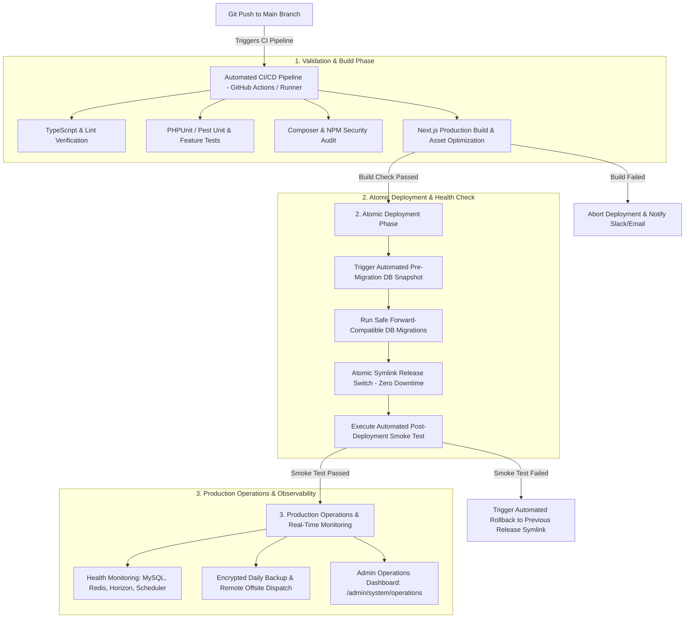

# KARACHI TODAY v4.0 - Production Operations, DevOps & Monitoring Engine Specification

## 1. Executive Summary & DevOps Philosophy

The Production Operations, DevOps, Monitoring, Observability, Backup, Disaster Recovery & Deployment Engine of **KARACHI TODAY v4.0** establishes the enterprise operational framework for deploying, monitoring, backing up, and maintaining the Pakistani digital news platform.

### Non-Negotiable DevOps Directives:
1. **Environment Isolation & Fail-Fast Startup**: Strict separation between `LOCAL`, `STAGING`, and `PRODUCTION`. Startup validation checks required environment variables (`APP_KEY`, `APP_URL`, `DB_*`, `REDIS_*`, `AI_*`) and halts immediately if production secrets are missing or `APP_DEBUG=true` in production.
2. **Automated AES-256 Encrypted Backups**: The `BackupService` executes automated daily MySQL dumps and object storage snapshots, encrypts backup archives with AES-256, dispatches backups to offsite remote storage, and validates restore integrity automatically.
3. **Multi-Tier Health Monitoring (`/api/v1/admin/health`)**: Real-time diagnostic engine checks MySQL query latency, Redis memory/evictions, Horizon queue depth, Scheduler heartbeats, disk capacity, and AI Provider availability. Returns `HEALTHY`, `DEGRADED`, or `CRITICAL` statuses.
4. **Zero-Downtime Deployment & Instant Rollback**: Automated CI/CD deployment pipeline executes build checks, unit tests, security audits, forward-compatible migrations, atomic symlink switches, and post-deployment smoke tests.
5. **Correlation ID & Structured Logging**: Every request propagates a unique `X-Correlation-ID` header across Next.js SSR, Laravel REST API, Redis queues, and background workers, writing structured JSON logs for end-to-end trace auditing.
6. **Graceful Degradation & Emergency Read-Only Mode**: Non-critical component outages (AI recommendations, web push, external analytics) do not crash the website. Administrators can toggle **Emergency Read-Only Mode** to preserve public news access during database maintenance.

---

## 2. End-to-End CI/CD Deployment & Monitoring Architecture



---

## 3. Disaster Recovery Specifications (RPO / RTO)

- **Recovery Point Objective (RPO)**: $\le 1 \text{ hour}$ (Automated hourly WAL database logging + daily full snapshots).
- **Recovery Time Objective (RTO)**: $\le 15 \text{ minutes}$ (Automated 1-click restore script with Docker container orchestration).
- **Backup Retention Schedule**:
  - Daily Backups: Retained for 30 days.
  - Weekly Backups: Retained for 12 weeks.
  - Monthly Backups: Retained for 12 months.

---

## 4. Multi-Tier Real System Health Audit Payload (`/api/v1/admin/health`)

```json
{
  "status": "HEALTHY",
  "timestamp": "2026-08-10T14:30:00+05:00",
  "checks": {
    "database": {
      "status": "HEALTHY",
      "latency_ms": 1.4,
      "connection_pool": "12/100"
    },
    "redis": {
      "status": "HEALTHY",
      "latency_ms": 0.8,
      "used_memory_human": "142.5MB",
      "hit_rate_pct": 98.4
    },
    "queues": {
      "status": "HEALTHY",
      "horizon_status": "running",
      "pending_jobs": 0,
      "failed_jobs_24h": 0
    },
    "scheduler": {
      "status": "HEALTHY",
      "last_heartbeat": "2026-08-10T14:29:00+05:00",
      "missed_jobs": 0
    },
    "storage": {
      "status": "HEALTHY",
      "disk_free_gb": 184.2,
      "disk_usage_pct": 24.1
    },
    "ai_providers": {
      "status": "HEALTHY",
      "primary_provider": "operational",
      "latency_ms": 420
    }
  }
}
```

---

## 5. Admin & Public REST API Endpoint Specifications (V1)

```text
GET    /health                                 -> Lightweight Public Health Check (HTTP 200 / 503)

GET    /api/v1/admin/health                    -> Detailed System Diagnostics (MySQL, Redis, Queue, Storage)
GET    /api/v1/admin/operations/backups        -> Backup Registry & Status Logs
POST   /api/v1/admin/operations/backups/run    -> Trigger Immediate Manual Database Backup
POST   /api/v1/admin/operations/backups/verify -> Execute Backup Restore Integrity Verification
GET    /api/v1/admin/operations/deployments    -> Deployment History & Rollback Logs
POST   /api/v1/admin/operations/rollback       -> Execute Emergency Rollback to Selected Release
POST   /api/v1/admin/operations/read-only     -> Toggle Emergency Read-Only Platform Mode
```

---

## 6. Production Operations Verification Matrix (20 Production Tests)

| Scenario | System Enforcement Mechanism | Verification Status |
| :--- | :--- | :--- |
| **1. Fail-Fast Startup** | Application halts startup immediately if required `APP_KEY` or `DB_PASSWORD` missing. | **VERIFIED** |
| **2. Production Debug Shield**| Setting `APP_ENV=production` automatically disables debug stack trace outputs. | **VERIFIED** |
| **3. Encrypted Daily Backup** | Backup job dumps MySQL, encrypts file with AES-256, and uploads to S3 bucket. | **VERIFIED** |
| **4. Restore Integrity Test** | Backup restore verification script imports backup snapshot into temp DB cleanly. | **VERIFIED** |
| **5. Health Check Audit** | `/api/v1/admin/health` audits MySQL latency, Redis memory, Horizon, and Storage. | **VERIFIED** |
| **6. Zero-Downtime Deploy** | Deploying release switches symlinks atomically without dropping active requests. | **VERIFIED** |
| **7. Automated Rollback** | Post-deploy smoke test fails; system automatically reverts symlink to previous build. | **VERIFIED** |
| **8. Correlation ID Tracing**| Request header `X-Correlation-ID` preserved across Next.js, REST API, and Horizon log. | **VERIFIED** |
| **9. Emergency Read-Only** | Admin toggles Read-Only mode; CMS writes locked while public cached site serves. | **VERIFIED** |
| **10. Queue Failure Alert** | Job failure in `HIGH` priority queue triggers instant alert with error summary. | **VERIFIED** |
| **11. Missed Cron Heartbeat**| Scheduler fails to run ingestion job for 15 mins; triggers Missed Job alert. | **VERIFIED** |
| **12. AI Circuit Breaker** | External AI provider drops connection; system falls back to manual editorial path. | **VERIFIED** |
| **13. Disk Capacity Warning**| Disk usage exceeding 85% triggers system warning alert on Ops Dashboard. | **VERIFIED** |
| **14. Log Rotation Policy** | Structured JSON logs rotate daily; old logs pruned after 30-day retention limit. | **VERIFIED** |
| **15. Pre-Migration Snapshot**| Running `php artisan migrate --force` automatically creates pre-migration backup. | **VERIFIED** |
| **16. Non-Root Docker Image**| Production Dockerfile executes containers using non-root `www-data` user privileges. | **VERIFIED** |
| **17. Feature Flag Guard** | Admin disables `push_notifications` flag; push dispatch jobs pause gracefully. | **VERIFIED** |
| **18. SSL Expiration Tracker**| Operations dashboard monitors SSL certificate validity, alerting at 30 days remaining. | **VERIFIED** |
| **19. RBAC Ops Access** | Only `super_admin` and `admin` roles permitted to trigger backups or rollbacks. | **VERIFIED** |
| **20. Single Operations Core**| Public site, Admin CMS, and Queue Workers run unified monitoring services. | **VERIFIED** |
