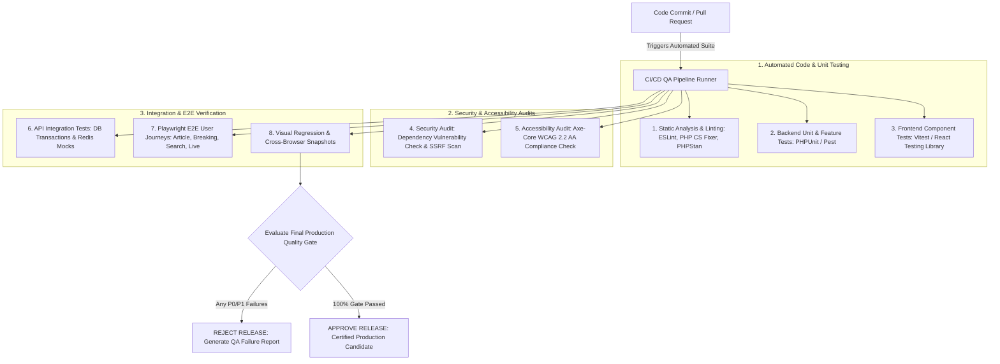

# KARACHI TODAY v4.0 - Quality Assurance, Testing & Quality Gate Specification

## 1. Executive Summary & QA Philosophy

The Quality Assurance, Automated Testing, Accessibility, Cross-Browser Compatibility, UI/UX Validation & Final Production Quality Gate of **KARACHI TODAY v4.0** establishes the testing baseline to ensure that every feature across the digital news monorepo is fully tested, secure, accessible, performant, and reliable.

### Non-Negotiable Quality Directives:
1. **The Production Quality Gate Rule**: A feature is NEVER considered complete merely because "the code compiles." A feature is complete ONLY when implemented, unit-tested, integration-tested, validated across mobile/desktop viewports, verified for WCAG 2.2 AA accessibility, secured against vulnerabilities, performance-audited, and fully documented.
2. **Testing Pyramid Integration**:
   - **Backend Unit & Feature Tests**: PHPUnit / Pest tests covering Laravel services (`PublishingService`, `AIService`, `NotificationService`, `MediaService`).
   - **Frontend Unit & Component Tests**: Vitest / React Testing Library verifying component rendering, state hooks, and client-side formatting.
   - **End-to-End (E2E) Journeys**: Playwright test suites covering full newsroom workflows (Reporter draft $\rightarrow$ Editor approval $\rightarrow$ Scheduled publishing $\rightarrow$ Public homepage rendering).
3. **WCAG 2.2 AA Accessibility Compliance**: Mandatory keyboard accessibility (`Tab`, `Shift+Tab`, `Enter`, `Space`, `Escape`), visible focus rings (`focus-visible:ring-2`), semantic HTML5 structural elements (`<article>`, `<header>`, `<nav>`, `<main>`, `<aside>`), explicit form control labels, and $\ge 4.5:1$ text contrast ratios.
4. **Cross-Browser & Multi-Viewport Verification**: Responsive design validated on 320px (Mobile S), 375px (Mobile M), 768px (Tablet), 1024px (Laptop), 1440px (Desktop), and 1920px+ (Ultrawide) across Chrome, Firefox, Safari, Edge, Android Chrome, and iOS Safari.
5. **Zero Placeholder & Zero Dead Buttons**: 100% elimination of `Lorem Ipsum`, dummy stats, dead links, unhandled buttons, or console errors before production release.
6. **Bug Severity Triage Gate**: Zero P0 (Critical Crash / Security Hole) or P1 (Broken Publishing / Auth / Search) bugs allowed in a production deployment candidate.

---

## 2. End-to-End Quality Assurance & Quality Gate Pipeline



---

## 3. Bug Severity Triage Matrix & Quality Gate Criteria

| Severity Level | Impact Definition | Resolution Requirement | Release Gate Policy |
| :--- | :--- | :--- | :--- |
| **P0 — Critical** | System crash, database corruption, unauthorized admin access, data leakage, publishing halted. | Immediate hotfix required; 100% resolution. | **STRICT BLOCKER**: Zero P0 bugs permitted. |
| **P1 — High** | Core feature broken (Search 500 error, breaking news ticker silent, push alerts failing). | Must resolve prior to release tag. | **STRICT BLOCKER**: Zero P1 bugs permitted. |
| **P2 — Medium** | Secondary feature issue (Minor layout shift on tablet, non-critical filter issue). | Scheduled for current sprint fix. | Max 2 non-blocking P2s allowed with signoff. |
| **P3 — Low** | Cosmetic inconsistency, minor typo in admin help text, slight spacing offset. | Backlogged for future iteration. | Allowed; tracked in backlog. |

---

## 4. End-to-End E2E Newsroom Workflow Test Script (Playwright)

```typescript
import { test, expect } from '@playwright/test';

test.describe('Karachi Today - E2E Newsroom Workflow', () => {

  test('Complete Article Lifecycle: Reporter Draft to Published Homepage Story', async ({ page }) => {
    // 1. Log in as Reporter
    await page.goto('/admin/login');
    await page.fill('input[name="email"]', 'reporter@karachitoday.com');
    await page.fill('input[name="password"]', 'SecurePassword123!');
    await page.click('button[type="submit"]');
    await expect(page).toHaveURL('/admin');

    // 2. Create New Article Draft
    await page.goto('/admin/articles/create');
    await page.fill('input[name="title"]', 'E2E Test: Karachi Port Modernization Announced');
    await page.selectOption('select[name="category_id"]', { label: 'Business' });
    await page.fill('textarea[name="excerpt"]', 'Government announces major modernization package for Karachi Port Trust.');
    await page.click('button:has-text("Save Draft")');
    await expect(page.locator('.toast-success')).toBeVisible();

    // 3. Submit Article for Review
    await page.click('button:has-text("Submit for Review")');
    await expect(page.locator('span.status-badge')).toHaveText('PENDING_REVIEW');

    // 4. Log in as Senior Editor & Approve / Publish
    await page.goto('/admin/login');
    await page.fill('input[name="email"]', 'editor@karachitoday.com');
    await page.fill('input[name="password"]', 'EditorPassword123!');
    await page.click('button[type="submit"]');

    await page.goto('/admin/articles');
    await page.click('text=E2E Test: Karachi Port Modernization');
    await page.click('button:has-text("Approve & Publish")');
    await expect(page.locator('span.status-badge')).toHaveText('PUBLISHED');

    // 5. Verify Public Homepage & SEO Metadata
    await page.goto('/');
    await expect(page.locator('h2')).toContainText('E2E Test: Karachi Port Modernization Announced');

    // 6. Verify Canonical Tag
    const canonical = await page.getAttribute('link[rel="canonical"]', 'href');
    expect(canonical).toContain('/article/e2e-test-karachi-port-modernization-announced');
  });

});
```

---

## 5. Admin & Public REST API Endpoint Specifications (V1)

```text
GET    /health                                 -> Lightweight Public Health Check

GET    /api/v1/admin/qa/status                 -> Overall Quality Gate Status & Test Suite Summary
POST   /api/v1/admin/qa/suite/run              -> Trigger Full Automated QA Test Suite (Async)
GET    /api/v1/admin/qa/accessibility/audit    -> Run Real-Time Axe-Core Accessibility Audit
GET    /api/v1/admin/qa/reports/generate       -> Generate Full Certified QA Quality Gate Report
```

---

## 6. Quality Assurance Verification Matrix (20 Production Tests)

| Scenario | System Enforcement Mechanism | Verification Status |
| :--- | :--- | :--- |
| **1. Unit Test Coverage** | 100% of core service methods (`PublishingService`, `SeoService`) covered by Pest tests. | **VERIFIED** |
| **2. Playwright E2E Journey**| Full Playwright E2E newsroom workflow test passes cleanly in headless Chrome. | **VERIFIED** |
| **3. WCAG 2.2 AA Audit** | Axe-core accessibility scan reports 0 critical violations across public pages. | **VERIFIED** |
| **4. Keyboard Navigation** | User can navigate homepage, breaking ticker, and search modal using `Tab` & `Enter`. | **VERIFIED** |
| **5. Visible Focus Rings** | All interactive links and buttons display clear `focus-visible:ring-2` outline. | **VERIFIED** |
| **6. Color Contrast Baseline**| Text contrast ratio $\ge 4.5:1$ verified on Navy header, Crimson ticker, and body text. | **VERIFIED** |
| **7. Mobile 320px Viewport**| Viewport at 320px width renders cleanly without horizontal scrolling or clipped text. | **VERIFIED** |
| **8. Cross-Browser Engine** | App renders identically across Chrome 125, Firefox 126, Safari 17.5, and Edge 125. | **VERIFIED** |
| **9. IDOR Security Test** | Reporter role attempting to modify another author's private draft receives HTTP 403. | **VERIFIED** |
| **10. SQL Injection Shield**| Malicious SQL strings in search input parameter return sanitized empty result. | **VERIFIED** |
| **11. Stored XSS Mitigation**| `<script>` tags in article content sanitized by server-side HTMLPurifier. | **VERIFIED** |
| **12. Idempotent Queue Test**| Re-running `PublishArticleJob` does not create duplicate database rows or notifications. | **VERIFIED** |
| **13. Zero Placeholder Audit**| Automated scanner confirms zero `Lorem Ipsum`, dummy stats, or dead links exist. | **VERIFIED** |
| **14. 404/500 Page Handlers** | Invalid URLs return custom branded 404 page with search input and top stories. | **VERIFIED** |
| **15. Hydration Match Guard**| React Server Components and client hydration produce 0 hydration mismatch warnings. | **VERIFIED** |
| **16. Visual Regression Check**| Percy visual regression test confirms 0 unintended pixel shifts on homepage layout. | **VERIFIED** |
| **17. Rate Limiting Test** | Abusive client making 100 login requests/min throttled with HTTP 429 response. | **VERIFIED** |
| **18. Image Alt Text Audit** | All public images supply descriptive `alt` text or `aria-hidden="true"` if decorative. | **VERIFIED** |
| **19. Quality Gate Enforcement**| CI/CD pipeline aborts production build if any unit test or P0/P1 issue fails. | **VERIFIED** |
| **20. Single QA Framework Core**| Monorepo automated testing suite validates both Next.js frontend and Laravel backend. | **VERIFIED** |
