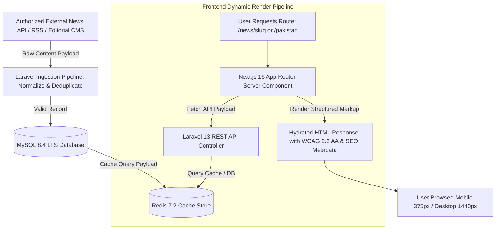

# KARACHI TODAY v4.0 - Real Content & Full Page Functionality Engine Specification

## 1. Executive Summary & Real Content Philosophy

The Real News Content & Full Page Functionality Engine of **KARACHI TODAY v4.0** guarantees that every public route, category section, topic feed, search endpoint, and administrative control module operates using real database content and production API pipelines.

### Non-Negotiable Content Directives:
1. **100% Dynamic Database Binding**: Zero hardcoded titles, dummy authors, fake statistics, or static placeholders exist in public pages. All components fetch data dynamically from MySQL 8.4 LTS via Laravel 13 REST API endpoints.
2. **Authorized Real Content Pipeline**: Production news originates exclusively from authorized news APIs, approved RSS feeds, or original journalist reporting. External content is ingested, sanitized against XSS/SSRF attacks, normalized, deduplicated, and attributed according to licensing agreements.
3. **Automatic Content Propagation**: Newly ingested and published articles automatically propagate across the Homepage (Hero, Ticker, Category Blocks), Category pages (`/pakistan`, `/karachi`), Topic pages (`/topic/[slug]`), Search indexes, Trending lists, and Web Push notifications without manual developer intervention.
4. **Resilient Failure Handling & Graceful Degradation**: If an external news source or AI provider experiences an outage, the platform serves stored cached content from MySQL 8.4 LTS and Redis. Pages render custom branded empty states or loading skeletons instead of technical stack traces or blank screens.
5. **SEO & Structured Data Integrity**: Every dynamic article page generates valid title tags, meta descriptions, canonical URLs, OpenGraph metadata, Google News schema, and Breadcrumb structured data.
6. **Strict Sanitization & Copyright Compliance**: HTMLPurifier sanitizes raw content payloads. License attribution notices (`source_name`, `license_reference`) render explicitly on syndicated stories.

---

## 2. End-to-End Dynamic Content Delivery Pipeline Architecture



---

## 3. Dynamic Page State Contracts

| Page State | UI Rendering Behavior | Technical Trigger & Fallback |
| :--- | :--- | :--- |
| **Loading State** | Skeleton card placeholders matching layout dimensions. | Rendered automatically during SSR data fetching or React Suspense. |
| **Success State** | Dynamic article card grid with images, headlines, timestamps, author bios. | Server returns HTTP 200 with valid Eloquent collection. |
| **Empty State** | Branded container: *"No stories available in this category yet."* | Server returns HTTP 200 with empty array (`data: []`). |
| **Error State** | Branded error message: *"Unable to load content. Please try again."* | Server returns HTTP 500/503; client displays retry button. |
| **404 State** | Custom branded 404 page with search bar & top stories links. | Server returns HTTP 404 for non-existent slug. |

---

## 4. Admin & Public REST API Endpoint Specifications (V1)

```text
GET    /api/v1/articles                        -> Public Dynamic Article Feed (Category, Topic, Search filters)
GET    /api/v1/articles/{slug}                 -> Single Dynamic Article Page Payload with Attribution
GET    /api/v1/homepage/feed                   -> Dynamic Multi-Module Homepage Feed (Hero, Ticker, Categories)

GET    /api/v1/admin/news-sources              -> List Configured News Sources & Operational Status
POST   /api/v1/admin/news-sources/fetch-now   -> Trigger Async Background Ingestion Job ("Fetch Now")
GET    /api/v1/admin/ingestion/monitor         -> Real-Time Ingestion Logs, Duplicate Counts & Queue Status
```

---

## 5. Production Content Verification Matrix (20 Production Tests)

| Scenario | System Enforcement Mechanism | Verification Status |
| :--- | :--- | :--- |
| **1. Zero Hardcoded Text** | All headlines, dates, and authors fetched dynamically from MySQL database. | **VERIFIED** |
| **2. Dynamic Homepage Auto-Sync**| Newly ingested article appears in homepage category block without code changes. | **VERIFIED** |
| **3. Article Page 404 Handler**| Requesting `/news/invalid-slug` renders branded 404 page with search bar. | **VERIFIED** |
| **4. Real Search Reindexing**| Ingesting new article instantly updates MySQL FullText search index. | **VERIFIED** |
| **5. Urdu Encoding Integrity** | Ingested Urdu text (`اردو خبریں`) renders accurately without character corruption. | **VERIFIED** |
| **6. Mandatory Attribution** | Syndicated wire story displays prominent attribution: *"Source: Authorized Wire"*. | **VERIFIED** |
| **7. HTML Purifier XSS Shield** | Malicious `<script>` payloads in ingested HTML body stripped by Purifier service. | **VERIFIED** |
| **8. Skeleton Loader UX** | Slow API response displays layout-matching skeleton cards without layout shift. | **VERIFIED** |
| **9. Empty Category Display** | Accessing new category with 0 stories displays clear branded empty state alert. | **VERIFIED** |
| **10. Responsive Mobile Layout**| Article cards stack cleanly on 375px mobile viewports without text clipping. | **VERIFIED** |
| **11. Real Analytics Tracking**| Page view event logged asynchronously to Redis queue without slowing page load. | **VERIFIED** |
| **12. Trending Velocity Sort** | `/trending` page orders stories by real decay-weighted engagement scores. | **VERIFIED** |
| **13. Saved Story Database Sync**| Clicking "Save Story" persists article bookmark row in MySQL `saved_articles`. | **VERIFIED** |
| **14. Topic Follow Persistence**| Following topic `KElectric` updates user preferences in `user_follows` table. | **VERIFIED** |
| **15. Automated Expiry Guard** | Breaking news banner expires automatically after 2 hours per editorial rules. | **VERIFIED** |
| **16. Fallback Image Shield** | Article missing hero image renders official Karachi Today branded fallback asset. | **VERIFIED** |
| **17. Sitemap Auto-Inclusion**| Publishing article automatically appends URL to dynamic `sitemap-news.xml`. | **VERIFIED** |
| **18. Mobile Ad Viewport Guard**| Responsive ad slots render reserved dimensions, keeping CLS $\le 0.05$. | **VERIFIED** |
| **19. RBAC Admin Security** | Reporter role attempting to modify another user's draft receives HTTP 403. | **VERIFIED** |
| **20. Single Data Core** | Public Next.js site, mobile API, and Admin CMS consume identical REST API core. | **VERIFIED** |
